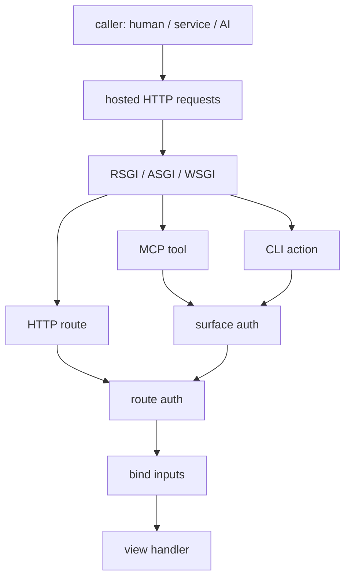

# Quater

Quater is a typed Python backend framework for building APIs that humans use
directly and AI agents can operate safely.

As AI systems become another real caller of backend systems, backends are no longer
called from one place. The same business operation may be used by a browser, an
internal service, an MCP client, or an operator running a CLI command. In
existing frameworks, those access paths become separate code paths: an HTTP
endpoint, an AI tool wrapper, an admin script, and extra glue code between them.

Quater is built around one rule: declare the operation once, then choose which
surfaces may call it.

You write one handler. It can remain a normal HTTP endpoint, and when you opt
in, Quater derives an MCP tool or CLI action from that route metadata. HTTP,
MCP, and CLI still have separate runtime surfaces, but they call the same
handler instead of asking you to maintain separate tool code or admin scripts.
Parameter binding, route-level auth, response normalization, and generated
schemas stay tied to the route.

Request flow:



## What Quater Focuses On

- **One declared operation:** HTTP, MCP tools, and CLI actions can share the same
  handler.
- **AI-readable operations:** descriptions and generated schemas tell agents
  what an exposed operation does and how to call it.
- **Explicit auth boundaries:** normal routes use `auth=...`, MCP uses
  `mcp_auth`, and CLI actions use `cli_auth`.
- **Operational safety:** CLI actions support dry-run and approval hooks for
  sensitive workflows.
- **Generated docs:** OpenAPI, Swagger UI, and MCP tool docs are generated from
  route metadata.
- **Fast defaults:** Quater uses Granian/RSGI, msgspec JSON, and a native route
  matcher.

## A Small App

```python
from quater import Quater, Request

app = Quater()


@app.get("/health")
async def health() -> dict[str, bool]:
    return {"ok": True}


@app.post("/echo")
async def echo(request: Request) -> dict[str, object]:
    return {"received": await request.json()}
```

Run it:

```bash
quater dev main.py
```

Quater serves docs by default:

- `GET /docs` for Swagger UI.
- `GET /openapi.json` for OpenAPI.
- `GET /mcp/docs` for exposed MCP tools.

## One Handler, Multiple Access Paths

```python
from quater import AuthContext, AuthRequest, Quater, Request


async def authenticate(ctx: AuthRequest) -> AuthContext | None:
    if ctx.headers.get("authorization") != "Bearer admin-token":
        return None
    return AuthContext(subject="admin")


app = Quater(
    mcp_auth=authenticate,
    cli_auth=authenticate,
)


@app.get(
    "/orders/{order_id}",
    tool=True,
    cli=True,
    auth=authenticate,
    description="Fetch one order by id.",
)
async def get_order(order_id: str, request: Request) -> dict[str, object]:
    assert request.auth is not None
    return {
        "order_id": order_id,
        "subject": request.auth.subject,
        "source": request.context.source,
    }
```

That one route is now:

- `GET /orders/ord_1001` for normal HTTP clients.
- an MCP tool available through `POST /mcp`.
- a local or remote CLI action.

For AI clients, the useful part is not just that the route becomes a tool. The
operation also has a human-written description and a generated input schema, so
the model can understand when to call it and what arguments are valid.

CLI discovery is intentionally compact:

```bash
quater connect store https://api.example.com --token admin-token
quater actions list store
```

```text
get_order
  Fetch one order by id.
```

The detailed command help lives behind `describe`:

```bash
quater actions describe store get_order
```

And execution stays straightforward:

```bash
quater call store get_order --order-id ord_1001
```

For sensitive actions, dry-run shows what would happen before the handler runs:

```text
Dry run OK: update_order_status
  PATCH /orders/ord_1001/status
  arguments hash: sha256:...
  protected action: yes
  approval token: missing
```

## Current Status

Quater is in its first alpha. The core is intentionally small: typed handlers,
RSGI-first serving, generated docs, MCP tools, CLI actions, explicit auth, and
security defaults. The API is still pre-release, so some names may change before
the first stable version.

## Read Next

- [Quickstart](docs/en/latest/quickstart.md)
- [Actions and CLI](docs/en/latest/actions.md)
- [MCP](docs/en/latest/mcp.md)
- [Security](docs/en/latest/security.md)
- [Public API](docs/en/latest/api.md)

## Working On Quater

This repo uses `uv`.

```bash
uv sync --group dev
uv run pytest
uv run mypy src examples tests
uv run ruff check .
uv build
```

Docs use VitePress:

```bash
npm install
npm run docs:dev
npm run docs:build
```
