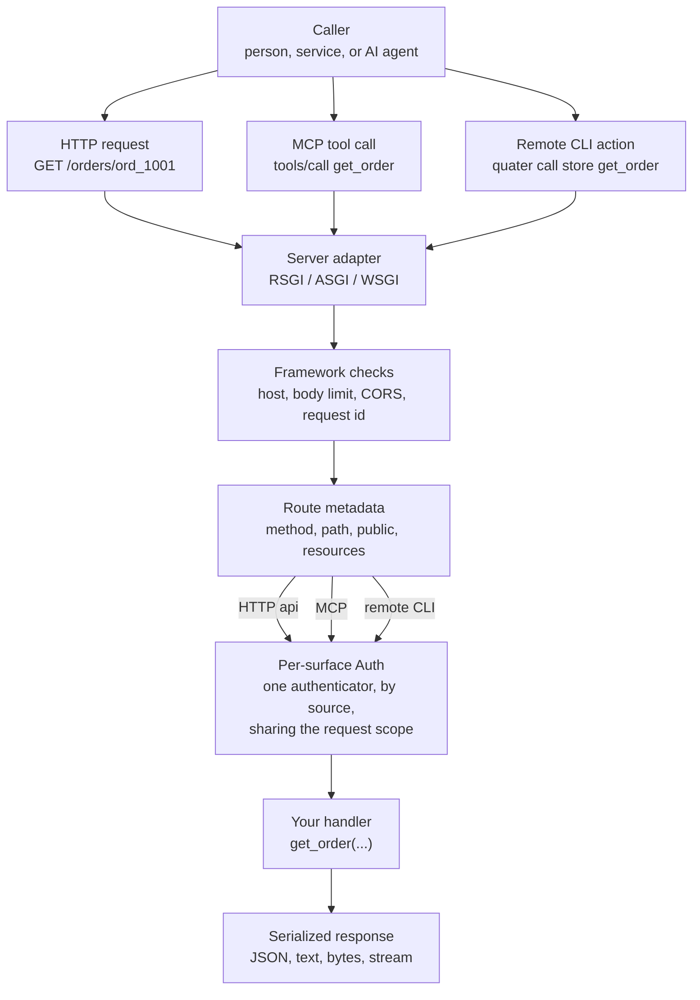
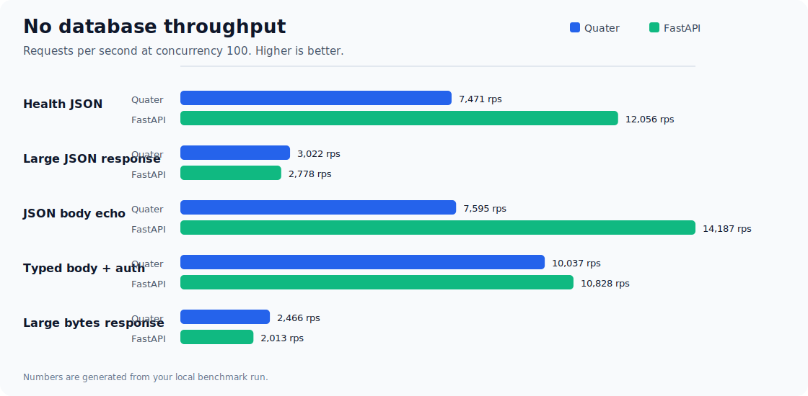
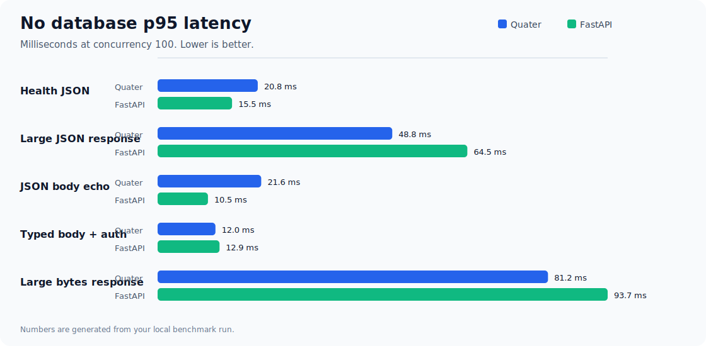
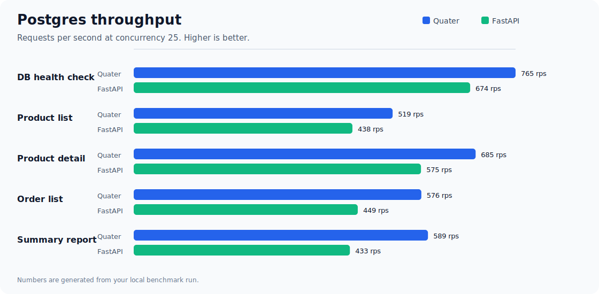
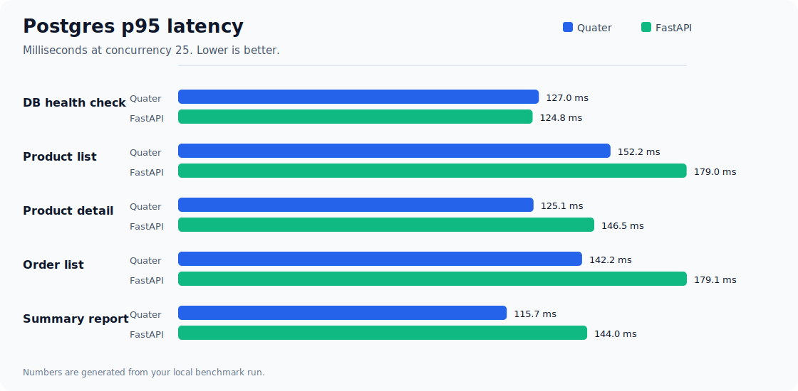

# Quater

<p align="left">
  <a href="https://github.com/DevilsAutumn/quater/actions/workflows/ci.yml">
    
  </a>
  <a href="https://codecov.io/gh/DevilsAutumn/quater">
    
  </a>
  
  <a href="https://github.com/DevilsAutumn/quater/blob/main/LICENSE">
    
  </a>
  <a href="https://quater.devilsautumn.com/en/dev/">
    
  </a>
</p>

Most backend frameworks were designed for one main job: serve data to a
frontend, then let humans click through that frontend to get work done.

That model still matters, but it is no longer enough. Moving ahead, more work is going to be
done by AI agents. Asking those agents to use a product through screens, buttons,
and forms is slow, fragile, and often the wrong level of access. Agents need a
safe way to work with the backend directly.

That does not mean giving agents unlimited access. It means exposing the right
operations, with clear inputs, clear descriptions, real auth, audit trails, and
approval gates where the action is sensitive.

Quater is a Python backend framework built for this shift. You build a normal
backend for people and services, and you can expose selected views directly
to MCP Clients through MCP or to AI agents through the CLI. The same operation can
serve the app, power an agent, and support production workflows without becoming
three different pieces of code.

The goal is simple: make the backend usable by humans and operable by AI agents,
without losing safety, structure, or ownership of the application logic.

## Highlights

- One view serves HTTP, MCP, and CLI. You annotate the route once and all three entry points share the same logic, auth, and validation.
- Exposing a view to AI agents takes a single flag. No extra service, no separate schema file, no adapter to maintain.
- Security is on by default. Host checking, CORS, body limits, and request IDs run without you touching configuration.
- Every request carries source and entrypoint metadata, so audit logs always know weather a human or an AI agent used your backend and how it arrived.
- It gives slightly better performance than FastAPI for real workloads, with no measurable overhead when database I/O dominates.
- Its simple to use, with a small API surface and no extra configuration required.

## A Small App

```python
from quater import AuthConfig, AuthContext, HTTPError, Quater, Request


async def authenticate(request: Request) -> AuthContext | None:
    if request.headers.get("authorization") != "Bearer admin-token":
        return None
    return AuthContext(subject="admin")


app = Quater(auth=[AuthConfig(authenticate, surfaces=["api", "mcp", "cli"])])

ORDERS: dict[str, dict[str, object]] = {
    "ord_1001": {"id": "ord_1001", "status": "paid", "total": 42.5}
}


@app.get("/health", public=True)
async def health() -> dict[str, bool]:
    return {"ok": True}


@app.get(
    "/orders/{order_id}",
    tool=True,
    cli=True,
    description="Fetch one order by id.",
)
async def get_order(order_id: str, request: Request) -> dict[str, object]:
    order = ORDERS.get(order_id)
    if order is None:
        raise HTTPError("Order not found", status_code=404)
    assert request.auth is not None
    return {
        **order,
        "subject": request.auth.subject,
        "source": request.context.source,
        "entrypoint": request.context.entrypoint,
    }
```

Run it:

```bash
python -m pip install quater
quater dev main.py
```

If you use [uv](https://docs.astral.sh/uv/), install with `uv add quater`
instead.

Expected server output:

```text
[INFO] Starting granian
[INFO] Listening at: http://127.0.0.1:8000
```

1. Call HTTP:

```bash
curl -H "Authorization: Bearer admin-token" \
  http://127.0.0.1:8000/orders/ord_1001
```

```json
{
  "id": "ord_1001",
  "status": "paid",
  "total": 42.5,
  "subject": "admin",
  "source": "api",
  "entrypoint": "server"
}
```

2. Call the same handler as an MCP tool:

```bash
curl http://127.0.0.1:8000/mcp \
  -H "Authorization: Bearer admin-token" \
  -H "Content-Type: application/json" \
  -d '{"jsonrpc":"2.0","id":1,"method":"tools/call","params":{"name":"get_order","arguments":{"order_id":"ord_1001"}}}'
```

```json
{
  "jsonrpc": "2.0",
  "id": 1,
  "result": {
    "content": [
      {
        "type": "text",
        "text": "{\"id\":\"ord_1001\",\"status\":\"paid\",\"total\":42.5,\"subject\":\"admin\",\"source\":\"mcp\",\"entrypoint\":\"server\"}"
      }
    ],
    "isError": false
  }
}
```

3. Call the same handler from the local CLI without a server round trip:

```bash
export QUATER_APP=main:app
export QUATER_TOKEN=admin-token
quater actions list
quater call get_order --order-id ord_1001
```

```json
{
  "id": "ord_1001",
  "status": "paid",
  "total": 42.5,
  "subject": "admin",
  "source": "cli",
  "entrypoint": "local"
}
```

4. For a hosted app, connect once and call the named remote, just like git:

```bash
quater connect store https://api.example.com --token admin-token
quater actions describe store get_order
quater call store get_order --order-id ord_1001
```

## Data flow diagram



## Why This Shape

Quater treats HTTP, MCP, and CLI as different ways to reach the same backend
capability, not as three products you have to maintain.

- **For people and services:** Quater gives you normal HTTP APIs with route
  decorators, OpenAPI, Swagger UI, request binding, response classes, route
  groups, middleware, and tests.
- **For MCP Clients:** `tool=True` exposes selected routes through MCP with
  required descriptions, generated input schemas, transport auth, MCP docs, and
  audit hooks.
- **For AI agents:** `cli=True` exposes selected routes as local or remote CLI
  actions with discovery, dry-run, approval hooks, and JSON output for scripts.
- **For the app itself:** auth context, resources, `app.state`, lifespan hooks,
  and serialization stay attached to the handler instead of drifting into
  wrappers.
- **For performance:** the request path stays deliberately small with
  Granian/RSGI, msgspec JSON, and a native route matcher.

## Benchmarks

To measure performance, we ran [benchmarks](benchmarks/) on an Apple M2 with an 8-core CPU, 16 GiB RAM, macOS 26.3, Python 3.11.12, and one worker per app. Quater performed slightly better than FastAPI when real database work was involved.

For very small endpoints without database access, FastAPI can be faster because the benchmark mostly measures framework overhead. Quater still runs built-in checks such as host validation, request IDs, body limits, and security headers on every request.

In the latest run, Quater used Granian/RSGI, while FastAPI used Uvicorn with uvloop and httptools. Full setup, commands, and CSV files are available in [benchmarks](benchmarks/).

<table>
  <tr>
    <td></td>
    <td></td>
  </tr>
  <tr>
    <td></td>
    <td></td>
  </tr>
</table>

## Current Status

Quater is in pre-release stage. The documented top-level imports are the public surface,
but names and defaults can still change before the first stable release.

## Documentation

- [Quickstart](docs/en/dev/quickstart.md): build the first app.
- [Why Quater Exists](docs/en/dev/why-quater.md): understand the problem
  Quater is built around.
- [Manual](docs/en/dev/index.md): read the full guide and reference.

## Agent Skills

Quater ships two agent skills:

- `quater-apps`: for operating applications built with Quater through MCP, CLI actions, and
  HTTP. The applications build on quater can have their own skills for operating their applications.
- `quater-framework`: for building and debugging applications with Quater.

Install the app-operator skill:

```bash
npx -y skills add \
  https://github.com/DevilsAutumn/quater/tree/main/agent-skills/quater-apps
```

Install the framework-development skill:

```bash
npx -y skills add \
  https://github.com/DevilsAutumn/quater/tree/main/agent-skills/quater-framework
```

## Working On Quater

This repo uses [uv](https://docs.astral.sh/uv/) for local development:

```bash
uv sync --group dev
uv run pytest
uv run mypy
uv run ruff format --check src tests scripts
uv run ruff check src tests scripts
uv build
```

Docs use VitePress:

```bash
npm install
npm run docs:reference
npm run docs:dev
npm run docs:build
```
