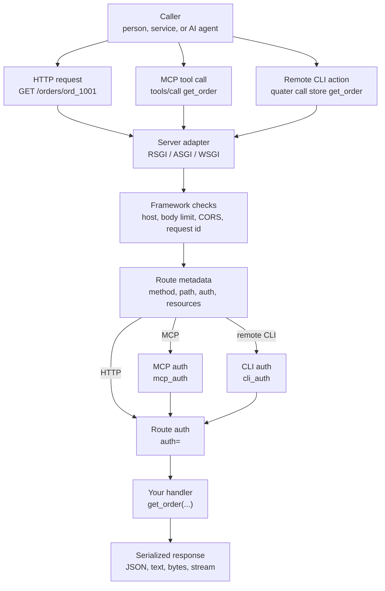

# Quater

Most backend frameworks were designed for one main job: serve data to a
frontend, then let humans click through that frontend to get work done.

That model still matters, but it is no longer enough. Moving ahead, more work is going to be
done by AI agents. Asking those agents to use a product through screens, buttons,
and forms is slow, fragile, and often the wrong level of access. Agents need a
safe way to work with the backend directly.

That does not mean giving agents unlimited access. It means exposing the right
operations, with clear inputs, clear descriptions, real auth, audit trails, and
approval gates where the action is sensitive.

Quater is a Python backend framework built for this shift. You build a normal
backend for people and services, and you can expose selected operations directly
to MCP Clients through MCP or to AI agents through the CLI. The same operation can
serve the app, power an agent, and support production workflows without becoming
three different pieces of code.

The goal is simple: make the backend usable by humans and operable by AI agents,
without losing safety, structure, or ownership of the application logic.

Quater is not trying to replace Django/FastAPI/Flask, ship an ORM, or hide your architecture
behind a large dependency graph. It focuses on the parts this new backend model
needs: typed handlers, explicit auth boundaries, AI-readable metadata,
operator-friendly actions, generated docs, and a small request path.



## A Small App

```python
from quater import AuthContext, AuthRequest, HTTPError, Quater, Request


async def authenticate(ctx: AuthRequest) -> AuthContext | None:
    if ctx.headers.get("authorization") != "Bearer admin-token":
        return None
    return AuthContext(subject="admin")


app = Quater(mcp_auth=authenticate, cli_auth=authenticate)

ORDERS: dict[str, dict[str, object]] = {
    "ord_1001": {"id": "ord_1001", "status": "paid", "total": 42.5}
}


@app.get("/health")
async def health() -> dict[str, bool]:
    return {"ok": True}


@app.get(
    "/orders/{order_id}",
    tool=True,
    cli=True,
    auth=authenticate,
    description="Fetch one order by id.",
)
async def get_order(order_id: str, request: Request) -> dict[str, object]:
    order = ORDERS.get(order_id)
    if order is None:
        raise HTTPError("Order not found", status_code=404)
    assert request.auth is not None
    return {
        **order,
        "subject": request.auth.subject,
        "source": request.context.source,
        "entrypoint": request.context.entrypoint,
    }
```

Run it:

```bash
uv add quater
quater dev main.py
```

Expected server output:

```text
[INFO] Starting granian
[INFO] Listening at: http://127.0.0.1:8000
```

Call HTTP:

```bash
curl -H "Authorization: Bearer admin-token" \
  http://127.0.0.1:8000/orders/ord_1001
```

```json
{
  "id": "ord_1001",
  "status": "paid",
  "total": 42.5,
  "subject": "admin",
  "source": "api",
  "entrypoint": "server"
}
```

Call the same handler from the local CLI without a server round trip:

```bash
export QUATER_APP=main:app
export QUATER_TOKEN=admin-token
quater actions list
quater call get_order --order-id ord_1001
```

```json
{
  "id": "ord_1001",
  "status": "paid",
  "total": 42.5,
  "subject": "admin",
  "source": "cli",
  "entrypoint": "local"
}
```

For a hosted app, connect once and call the named remote:

```bash
quater connect store https://api.example.com --token admin-token
quater actions describe store get_order
quater call store get_order --order-id ord_1001
```

## Why This Shape

Quater treats HTTP, MCP, and CLI as different ways to reach the same backend
capability, not as three products you have to maintain.

- **For people and services:** Quater gives you normal HTTP APIs with route
  decorators, OpenAPI, Swagger UI, request binding, response classes, route
  groups, middleware, and tests.
- **For MCP Clients:** `tool=True` exposes selected routes through MCP with
  required descriptions, generated input schemas, transport auth, MCP docs, and
  audit hooks.
- **For AI agents:** `cli=True` exposes selected routes as local or remote CLI
  actions with discovery, dry-run, approval hooks, and JSON output for scripts.
- **For the app itself:** route auth, resources, `app.state`, lifespan hooks,
  and serialization stay attached to the handler instead of drifting into
  wrappers.
- **For performance:** the request path stays deliberately small with
  Granian/RSGI, msgspec JSON, and a native route matcher.

## Current Status

Quater is pre-release. The documented top-level imports are the public surface,
but names and defaults can still change before the first stable release. Pin the
version you test with.

## Documentation

- [Quickstart](docs/en/dev/quickstart.md): build the first app.
- [Why Quater Exists](docs/en/dev/why-quater.md): understand the problem
  Quater is built around.
- [Manual](docs/en/dev/index.md): read the full guide and reference.

## Agent Skills

Quater ships two agent skills:

- `quater-apps`: for operating applications built with Quater through MCP, CLI actions, and
  HTTP.
- `quater-framework`: for building and debugging applications with Quater.

Install the app-operator skill for Codex:

```bash
npx -y skills add \
  https://github.com/DevilsAutumn/quater/tree/main/agent-skills/quater-apps \
  -a codex
```

Install the framework-development skill for Codex:

```bash
npx -y skills add \
  https://github.com/DevilsAutumn/quater/tree/main/agent-skills/quater-framework \
  -a codex
```

Use a different `-a` value for a different agent:

```bash
npx -y skills add \
  https://github.com/DevilsAutumn/quater/tree/main/agent-skills/quater-apps \
  -a claude-code
```

You can repeat `-a` to install into more than one agent:

```bash
npx -y skills add \
  https://github.com/DevilsAutumn/quater/tree/main/agent-skills/quater-apps \
  -a codex \
  -a claude-code \
  -a cursor
```

Common agent identifiers include `codex`, `claude-code`, `cursor`,
`github-copilot`, `gemini-cli`, `windsurf`, `opencode`, `cline`, `roo`, `amp`,
and `antigravity`. If you omit `-a`, the installer will try to detect the
available agents on your machine.

## Working On Quater

This repo uses [uv](https://docs.astral.sh/uv/) for local development:

```bash
uv sync --group dev
uv run pytest
uv run mypy
uv run ruff format --check src tests scripts
uv run ruff check src tests scripts
uv build
```

Docs use VitePress:

```bash
npm install
npm run docs:reference
npm run docs:dev
npm run docs:build
```
