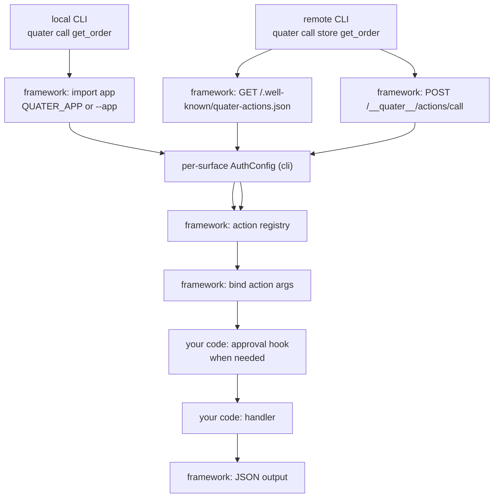

# Actions And CLI

This page explains how Quater exposes selected backend operations as local and
remote CLI actions.

## Prerequisites

Read the [Quickstart](/en/dev/quickstart) first. You need an app with at
least one route declared with `cli=True` and an `AuthConfig` covering `"cli"` on `Quater(auth=[...])`.

## Why Actions Exist

Production work does not always happen through the product UI. During an
incident, a rollout, or a support case, someone often needs to run a backend
operation directly.

Teams usually solve that with admin scripts. Over time those scripts become a
second version of the app: another auth path, another argument parser, and
another place for business logic to drift.

Quater actions keep the operation on the route. The CLI surface handles
discovery, argument parsing, dry-run, approval, and remote transport. The route
handler still performs the work.

Actions are not a replacement for shell scripts that manage your machine. They
are for app operations that already belong to your backend and should be safe to
run locally, remotely, or from an agent-controlled workflow.

## A Runnable Action

```python
from quater import AuthConfig, AuthContext, Quater, Request


async def authenticate(ctx: Request) -> AuthContext | None:
    if ctx.headers.get("authorization") != "Bearer admin-token":
        return None
    return AuthContext(subject="admin")


app = Quater(auth=[AuthConfig(authenticate, surfaces=["cli"])])


@app.get(
    "/orders/{order_id}",
    cli=True,
    description="Fetch one order by id.",
)
async def get_order(order_id: str, request: Request) -> dict[str, object]:
    assert request.auth is not None
    return {
        "order_id": order_id,
        "subject": request.auth.subject,
        "source": request.context.source,
        "entrypoint": request.context.entrypoint,
    }
```

Run local discovery:

```bash
export QUATER_APP=main:app
export QUATER_TOKEN=admin-token
quater actions list
```

Expected output:

```text
get_order
  Fetch one order by id.
```

Run the action:

```bash
quater call get_order --order-id ord_1001
```

Expected output:

```json
{
  "order_id": "ord_1001",
  "subject": "admin",
  "source": "cli",
  "entrypoint": "local"
}
```

## CLI Command Reference

Global options must appear before the command.

| Command | Flags | What it does |
| --- | --- | --- |
| `quater dev [target]` | `--host`, `--port`, `--interface`, `--loop`, `--workers`, `--reload/--no-reload`, `--access-log/--no-access-log`, `--log-level`, `--factory`, `--working-dir` | Runs the app for development with reload enabled by default. |
| `quater run [target]` | Same as `dev`, plus `--allow-insecure` | Runs the app with production-style defaults and production checks. |
| `quater actions list [remote]` | `--app`, `--token`, `--header`, `--json` | Lists action names and descriptions. |
| `quater actions search [remote] <query>` | `--app`, `--token`, `--header`, `--json` | Searches action names, descriptions, methods, and paths. |
| `quater actions describe [remote] <action>` | `--app`, `--token`, `--header`, `--json` | Shows the selected action schema and usage. |
| `quater call [remote] <action>` | `--dry-run`, `--approval`, action flags, plus global auth flags | Calls one local or remote action. |
| `quater connect <name> <url>` | `--token`, `--json` | Saves a remote app. |
| `quater login <name>` | `--token`, `--json` | Replaces a remote token. |
| `quater remotes list` | `--json` | Lists saved remotes. |

Local commands use `--app` or `QUATER_APP`. Local bearer tokens use `--token` or
`QUATER_TOKEN`.

```bash
quater --app main:app --token admin-token actions list
```

You can pass custom headers when the `cli` `AuthConfig` does not use bearer tokens:

```bash
quater --app main:app --header "X-Operator: admin" actions list
```

Quater rejects `--token` together with an explicit `Authorization` header:

```text
Use either --token or an Authorization header
```

## Local Vs Remote Flow

Local actions import the app in process. Remote actions call a hosted Quater app
over HTTP.



The `cli` `AuthConfig` protects local action discovery, local calls, remote manifest
discovery, and remote calls.

For a remote action, the CLI sends auth to both discovery and execution
endpoints. For a local action, Quater imports the app and builds an in-process
auth request from the CLI auth headers. In both modes, the handler receives the
`AuthContext` produced by the `cli` surface authenticator.

When Quater calls the route handler, it builds a synthetic request from the
action arguments. This applies regardless of how the handler reads the request:

- `Header()` and `Cookie()` parameters only see values passed as action arguments.
- If the handler injects `Request` directly and reads `request.headers`,
  `request.cookies`, or `await request.body()`, it still sees the synthetic
  request — not the outer CLI transport request.

The outer CLI transport headers, such as `Authorization`, `Cookie`,
`Content-Length`, and request ids, are used for the CLI surface and are not
copied into the handler request. Use `request.auth` for the authenticated caller
and `request.context` for source and action metadata.

::: warning CLI auth is not authorization
The `cli` `AuthConfig` answers "may this caller use the action surface?" Authorization
answers "may this caller run this handler?" Keep roles, ownership, and other
domain checks in the handler or service for sensitive operations.
:::

## Progressive Discovery

`actions list` and `actions search` return only action names and descriptions.
That keeps a large app readable for humans and smaller for agents.

```bash
quater actions search order
```

```text
get_order
  Fetch one order by id.
update_order_status
  Update an order status.
```

Use `describe` after you choose one action:

```bash
quater actions describe update_order_status
```

```text
update_order_status
  PATCH /orders/{order_id}/status
  Update an order status.
  protected action: yes
  arguments:
    --order-id <string>  required
    --status <string>  required
  usage:
    quater call update_order_status --order-id example --status example
  dry run:
    quater call update_order_status --dry-run --order-id example --status example
  approval:
    quater call update_order_status --approval <token> --order-id example --status example
```

Machine-readable output:

```bash
quater --json actions describe update_order_status
```

```json
{
  "name": "update_order_status",
  "method": "PATCH",
  "path": "/orders/{order_id}/status",
  "needs_approval": true,
  "arguments": [
    {"name": "order_id", "required": true, "type": "string"},
    {"name": "status", "required": true, "type": "string"}
  ]
}
```

## Argument Binding

CLI argument names come from the action schema. Quater renders Python
`snake_case` names as kebab-case flags:

```python
async def get_order(order_id: str) -> dict[str, str]: ...
```

```bash
quater call get_order --order-id ord_1001
```

Scalars use normal values. Objects and arrays use JSON:

```bash
quater call create_order \
  --order '{"customer_id":"cust_123","sku":"sku-coffee","quantity":2}'
```

HTTP aliases stay on the HTTP side for `Path`, `Query`, `Header`, and `Cookie`.
`Body(alias=...)` changes the CLI and MCP body argument name because the body has
no HTTP query or header name.

Body defaults are shared across HTTP, MCP, and CLI. If an action body argument
is omitted, Quater uses the handler's `Body(default=...)` value or `None` for a
`T | None` body, just like an empty HTTP request body.

`Form` fields behave like scalar arguments for actions. Quater encodes them as
form data before it calls the same handler path:

```python
from quater import Form


async def issue_token(
    grant_type: str = Form(),
    client_id: str = Form(),
) -> dict[str, str]:
    return {"grant_type": grant_type, "client_id": client_id}
```

```bash
quater call issue_token \
  --grant-type client_credentials \
  --client-id client_123
```

`File` parameters are not exposed as CLI actions in this release. A local file
path passed by an operator and a remote file upload are different trust
boundaries, so Quater rejects `cli=True` on routes with `File` parameters
instead of inventing unsafe behavior.

## Dry Run And Argument Hashes

Dry-run exists on every action. You do not write a separate dry-run handler.

```bash
quater call update_order_status \
  --dry-run \
  --order-id ord_1001 \
  --status shipped
```

Expected output:

```text
Dry run OK: update_order_status
  PATCH /orders/ord_1001/status
  arguments hash: sha256:23c4caa787b3348045a4844ec4d45422cc07a9daea3e90cf1fa1a1ab68a9c63b
  protected action: yes
  approval token: missing
```

Quater computes the argument hash after binding and validation, using the
action name plus canonical JSON for the arguments the handler will receive.
Defaults are included, type-normalized values hash the same way, and JSON
object key order does not change it. Use the hash when an approval system
grants permission for one exact call, not for every call with the same action
name.

## Approval

Auth identifies the caller. Approval confirms that a sensitive operation should
run for that caller and those exact arguments.

```python
from quater import ApprovalRequest, AuthConfig, AuthContext, Quater


async def authenticate(ctx: Request) -> AuthContext | None:
    if ctx.headers.get("authorization") != "Bearer admin-token":
        return None
    return AuthContext(subject="admin")


async def approve_action(ctx: ApprovalRequest) -> bool:
    return ctx.token == "approve-ord_1001"


app = Quater(auth=[AuthConfig(authenticate, surfaces=["cli"])], action_approval=approve_action)


@app.patch(
    "/orders/{order_id}/status",
    cli=True,
    needs_approval=True,
    description="Update an order status.",
)
async def update_order_status(order_id: str, status: str) -> dict[str, str]:
    return {"order_id": order_id, "status": status}
```

Call with approval:

```bash
quater call update_order_status \
  --approval approve-ord_1001 \
  --order-id ord_1001 \
  --status shipped
```

Expected output:

```json
{
  "order_id": "ord_1001",
  "status": "shipped"
}
```

If the token is missing, Quater returns:

```json
{
  "ok": false,
  "error": {
    "code": "approval_required",
    "message": "Approval required",
    "action": "update_order_status",
    "arguments_hash": "sha256:..."
  }
}
```

## Remote Actions

Connect once:

```bash
quater connect store https://api.example.com --token admin-token
```

Expected output:

```text
Connected remote store: https://api.example.com
```

Then call the remote:

```bash
quater actions list store
quater actions describe store get_order
quater call store get_order --order-id ord_1001
```

Remote URLs must use HTTPS unless they target localhost. Quater rejects
credentials, query strings, fragments, whitespace, and malformed URLs.

Quater stores only remote connection details at `~/.quater/remotes.json` by
default with `0600` file permissions. Action discovery is fetched from the
remote when you run `quater actions ...`. Set `QUATER_HOME` to use another
directory.

## What Can Go Wrong

`--app is required unless QUATER_APP is set`
: Local commands need an app import path.

`Unknown CLI action`
: The action name does not exist or the route does not have `cli=True`.

`401 Unauthorized`
: The token or custom header did not pass the `cli` `AuthConfig`, or the selected route's
  `auth=` denied the underlying handler call.

`Missing value for action argument --order-id`
: Pass a value after the flag.

`Invalid JSON value for --order`
: Object and array arguments must be valid JSON.

`Routes with File parameters cannot be exposed as MCP tools or CLI actions`
: Keep upload routes HTTP-only today, or split the upload from the operation
  that agents and operators may call.

`Approval token must not be empty`
: Pass a non-empty `--approval` value or omit the flag.

`Remote URL must use HTTPS unless it targets localhost`
: Use an HTTPS URL for deployed apps.

`Quater remote config is invalid`
: Delete or repair the file under `QUATER_HOME` or `~/.quater/remotes.json`.

## Also See

- [MCP](/en/dev/mcp): expose the same route to AI tools.
- [Security](/en/dev/security): review auth ordering and action discovery.
- [Deployment](/en/dev/deployment): understand hosted action endpoints.
- [Testing](/en/dev/testing): test actions through the in-process client.
