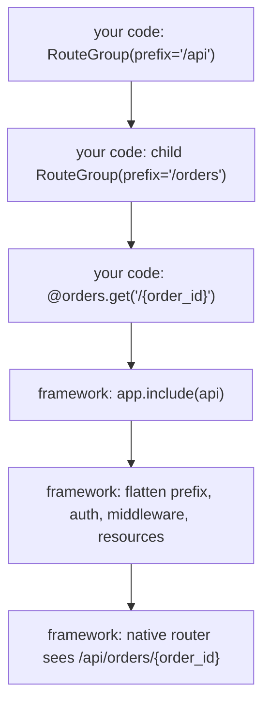

# Public API

This page explains the public Quater API in human terms before you use the
reference pages for exact signatures.

## Prerequisites

Read [Quickstart](/en/dev/quickstart). This page assumes you know what a
Quater route is and how handlers return responses.

## Public Imports

Application code should import from `quater`:

```python
from quater import (
    ActionApproval,
    AccessLogEvent,
    AccessLogHook,
    AppConfig,
    ApprovalRequest,
    AuthContext,
    AuthRequest,
    Body,
    BytesResponse,
    CORSConfig,
    Cookie,
    EmptyResponse,
    File,
    Form,
    FormData,
    Header,
    HTMLResponse,
    HTTPError,
    ImproperlyConfigured,
    JSONResponse,
    MCPTestClient,
    Path,
    Quater,
    Query,
    RedirectResponse,
    Request,
    Response,
    Resource,
    RouteGroup,
    SignedCookieSigner,
    State,
    StreamResponse,
    TestClient,
    TestResponse,
    TextResponse,
    ToolAuditEvent,
    UploadFile,
)
```

Everything else under `quater.*` can move unless a reference page documents it.

## Application

`Quater()` owns routes, config, middleware, lifespan hooks, and server adapters.

```python
from quater import Quater

app = Quater(
    name="Store API",
    allowed_hosts=["api.example.com"],
    max_body_size="2mb",
    docs_path="/docs",
    openapi_path="/openapi.json",
    mcp_docs_path="/mcp/docs",
)
```

Important constructor options:

- `debug`: include error details in framework errors.
- `security`: `"strict"`, `"relaxed"`, or `"off"`.
- `allowed_hosts`: accepted Host headers.
- `trusted_proxies`: proxy IPs or CIDR ranges trusted for forwarded headers.
- `cors`: browser CORS policy.
- `max_form_parts`, `max_file_size`, and response-size options: request and
  tool/action limits. These can also come from deployment environment variables.
- `mcp_auth`: surface auth for MCP. Required when any route has `tool=True`.
- `cli_auth`: surface auth for CLI actions. Required when any route has
  `cli=True`.
- `action_approval`: required when any exposed route has `needs_approval=True`.
- `access_logger`: receives structured access events.

See [Application Reference](/en/dev/reference/application) for every option,
type, default, and exception.

Surface auth does not replace route `auth=`. Use route or group auth for
handlers that should not be public HTTP endpoints.

## Routes

Route decorators register HTTP routes. The same route can opt into MCP and CLI.

```python
from quater import Quater

app = Quater()


@app.get("/orders/{order_id}", description="Fetch one order.")
async def get_order(order_id: str) -> dict[str, str]:
    return {"order_id": order_id}
```

Available decorators:

- `app.get`
- `app.post`
- `app.put`
- `app.patch`
- `app.delete`
- `app.route`

Route options:

- `name`
- `description`
- `tool`
- `cli`
- `needs_approval`
- `auth`
- `inject`
- `metadata`
- `before`
- `after`
- `around`
- `exception_handlers`

Quater reserves these paths:

- `/mcp` and `/mcp/...`
- `/.well-known/quater-actions.json`
- `/__quater__` and `/__quater__/...`

## Binding

Quater decides a handler parameter source in this order:

1. `inject={...}` resources
2. `Request`
3. parameter markers: `Path`, `Query`, `Body`, `Form`, `File`, `Header`,
   `Cookie`
4. route path names
5. scalar query parameters
6. JSON body parameters

```python
import msgspec

from quater import Body, Header, Path, Query, Quater


class UpdateOrder(msgspec.Struct):
    status: str
    notify_customer: bool = False


app = Quater()


@app.patch("/orders/{id}")
async def update_order(
    order_id: str = Path(alias="id", description="Order id."),
    payload: UpdateOrder = Body(description="New order state."),
    include_events: bool = Query(default=False, alias="include-events"),
    request_id: str | None = Header(default=None, alias="X-Request-ID"),
) -> dict[str, object]:
    return {
        "order_id": order_id,
        "status": payload.status,
        "include_events": include_events,
        "request_id": request_id,
    }
```

`msgspec.Struct` gives typed JSON validation and fast serialization through
[msgspec](https://jcristharif.com/msgspec/). Plain `dict` is fine for dynamic
responses.

Use [`Form`](/en/dev/reference/parameters#symbol-form) for scalar form
fields and [`File`](/en/dev/reference/parameters#symbol-file) for multipart
uploads. File parameters bind to
[`UploadFile`](/en/dev/reference/request#symbol-uploadfile), `bytes`,
`list[UploadFile]`, or `list[bytes]`.

```python
from quater import File, Form, Quater, UploadFile

app = Quater()


@app.post("/imports")
async def import_document(
    account_id: str = Form(),
    document: UploadFile = File(),
) -> dict[str, object]:
    content = await document.read()
    return {
        "account_id": account_id,
        "filename": document.filename,
        "size": len(content),
    }
```

## Middleware

Use middleware when you need cross-cutting behavior around routes.

`before` runs before route auth and binding. It can return a response to
short-circuit:

```python
from quater import Request, Response, TextResponse


async def require_request_id(request: Request) -> Response | None:
    if request.headers.get("x-request-id") is None:
        return TextResponse("Missing request id", status_code=400)
    request.state.request_id = request.headers["x-request-id"]
    return None
```

`after` runs after the handler response exists:

```python
async def add_timing_header(request: Request, response: Response) -> Response:
    response.headers = (*response.headers, ("x-handler", "orders"))
    return response
```

`around` wraps the handler pipeline:

```python
from collections.abc import Awaitable, Callable


async def audit_call(
    request: Request,
    call_next: Callable[[Request], Awaitable[Response]],
) -> Response:
    response = await call_next(request)
    print(request.path, response.status_code)
    return response
```

Attach middleware globally or on a route:

```python
app.before_request(require_request_id)


@app.get("/orders/{order_id}", after=[add_timing_header], around=[audit_call])
async def get_order(order_id: str) -> dict[str, str]:
    return {"order_id": order_id}
```

## Exception Handlers

Exception handlers map exception classes to responses without wrapping every
handler in `try`/`except`.

```python
from quater import JSONResponse, Quater, Request


class OrderNotFound(Exception):
    pass


app = Quater()


@app.exception_handler(OrderNotFound)
async def handle_order_not_found(
    request: Request,
    exc: OrderNotFound,
) -> JSONResponse:
    return JSONResponse({"error": "order_not_found"}, status_code=404)
```

Route-level handlers take precedence over group handlers, and group handlers
take precedence over global handlers.

## Route Groups

Route groups organize feature routes. Quater flattens them at startup.



Startup catches configuration errors such as duplicate routes, bad inject keys,
reserved paths, missing auth for tools, and invalid parameter markers.

## State And Lifespan

Use `app.state` for long-lived objects:

```python
from quater import Quater, Request

app = Quater()


@app.on_startup
async def startup() -> None:
    app.state.cache = {}


@app.on_shutdown
async def shutdown() -> None:
    app.state.cache.clear()


@app.get("/cache-size")
async def cache_size(request: Request) -> dict[str, int]:
    return {"size": len(request.app.state.cache)}
```

Use `request.state` for one-request values set by middleware.

## Responses

Handlers can return plain values:

- `dict`, `list`, `tuple`, dataclasses, and `msgspec.Struct` become JSON.
- `str` becomes text.
- `bytes`, `bytearray`, and `memoryview` become bytes.
- `None` becomes `204 No Content`.
- `Response` subclasses pass through directly.

Use explicit responses when you need status, headers, HTML, redirects, or
streams.

```python
from quater import JSONResponse, RedirectResponse


@app.post("/orders")
async def create_order() -> JSONResponse:
    return JSONResponse({"id": "ord_1001"}, status_code=201)


@app.get("/old-orders")
async def old_orders() -> RedirectResponse:
    return RedirectResponse("/orders")
```

## OpenAPI And Docs

Quater serves Swagger UI and [OpenAPI](https://swagger.io/specification/) by
default:

- `/docs`
- `/openapi.json`

Set either path to `None` to disable it. If `docs_path` exists, `openapi_path`
must exist.

## What Can Go Wrong

`Route handlers must be async functions`
: Declare route handlers with `async def`.

`Only one body parameter is supported`
: Move body fields into one `msgspec.Struct`.

`JSON body parameters cannot be combined with form or file parameters`
: A route can read one request body format. Use JSON, URL-encoded form data, or
  multipart form data for that handler.

`Path parameter 'order_id' does not match route path`
: Rename the handler parameter or use `Path(alias=...)`.

`Cannot register middleware after routes are compiled`
: Register middleware before startup, tests, or the first request compiles routes.

`docs_path requires openapi_path`
: Disable both paths or keep both enabled.

## Also See

- [Routes and Handlers](/en/dev/routes-handlers): route and binding concepts.
- [Middleware and Errors](/en/dev/middleware-errors): middleware and exception
  handlers in real use.
- [Reference](/en/dev/reference/): exact signatures and defaults.
- [Resources and Injection](/en/dev/resources): resource lifetimes.
- [Security](/en/dev/security): auth and production defaults.
- [Testing](/en/dev/testing): test the public API through `TestClient`.
