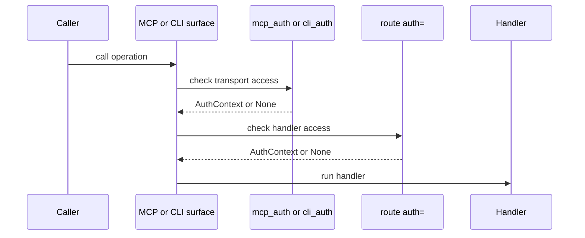

# Auth Model

This page explains how Quater separates surface auth from route auth across
HTTP, MCP, and CLI.

## Prerequisites

Read [HTTP, MCP, and CLI Surfaces](/en/dev/surfaces). If you expose tools or
actions, read [Security](/en/dev/security) before deployment.

## The Rule

Quater has two auth gates. Each gate answers a different question:

- `mcp_auth`: may this caller use the MCP transport?
- `cli_auth`: may this caller use the CLI action surface?
- route `auth=`: may this caller run this handler?

`mcp_auth` and `cli_auth` are surface auth. Route `auth=` is handler auth.
Quater does not collapse those layers because the surfaces have different risk.



HTTP routes skip surface auth and go directly to route `auth=` when it exists.
MCP and CLI calls must pass surface auth first, then route `auth=` if the route
declares it.

::: warning Surface auth is not route auth
If a route has no `auth=`, its HTTP endpoint is public even when the route also
has `tool=True` or `cli=True`. Add route `auth=` for every sensitive handler.
:::

## A Runnable Example

```python
from quater import AuthContext, AuthRequest, Quater, Request


async def authenticate(ctx: AuthRequest) -> AuthContext | None:
    if ctx.headers.get("authorization") != "Bearer demo-token":
        return None
    return AuthContext(subject="user_123", metadata={"scope": "orders:read"})


app = Quater(mcp_auth=authenticate, cli_auth=authenticate)


@app.get("/me", tool=True, cli=True, auth=authenticate, description="Current user.")
async def me(request: Request) -> dict[str, object]:
    assert request.auth is not None
    return {
        "subject": request.auth.subject,
        "source": request.context.source,
    }
```

Missing auth returns:

```text
401 Unauthorized
Unauthorized
```

## What Runs When

The same auth hook can safely be used for both gates, but Quater treats the
calls as separate checks.

For an MCP tool call:

1. `mcp_auth` sees `POST /mcp` with `source="mcp"`.
2. Quater resolves the tool to its route.
3. Route `auth=` sees the real route path, such as `/orders/ord_1001`.
4. The handler runs only after both checks pass.

For a remote CLI action:

1. `cli_auth` protects discovery and `POST /__quater__/actions/call`.
2. Quater resolves the action to its route.
3. Route `auth=` runs for the underlying route.
4. Approval runs when the route has `needs_approval=True`.

MCP `initialize` is not a login. Quater does not create an MCP session from it.
Every later `tools/list` and `tools/call` request must carry valid auth again.

## Auth And Approval

Auth identifies the caller. Approval confirms one sensitive operation should run
for that caller and exact argument set.

Use `needs_approval=True` for dangerous mutations exposed through MCP or CLI:

```python
@app.patch(
    "/orders/{order_id}/status",
    tool=True,
    cli=True,
    auth=authenticate,
    needs_approval=True,
    description="Update one order status.",
)
async def update_order_status(order_id: str, status: str) -> dict[str, str]:
    return {"order_id": order_id, "status": status}
```

## What Can Go Wrong

`401 Unauthorized`
: The auth hook returned `None`. Check the token, header name, and route auth
policy.

HTTP route unexpectedly public
: `mcp_auth` and `cli_auth` do not protect normal HTTP traffic. Add `auth=` to
  the route or to a `RouteGroup`.

MCP worked during `initialize` but failed later
: Send the bearer token on every MCP request. `initialize` does not create a
  Quater session.

`MCP tools require mcp_auth`
: A `tool=True` route exists without MCP transport auth.

`CLI actions require cli_auth`
: A `cli=True` route exists without CLI transport auth.

`needs_approval requires action_approval`
: A sensitive MCP or CLI operation exists without an approval hook.

## Also See

- [Security](/en/dev/security): production security details.
- [MCP Tools](/en/dev/mcp): MCP auth behavior.
- [Actions and CLI](/en/dev/actions): CLI auth and approval flows.
