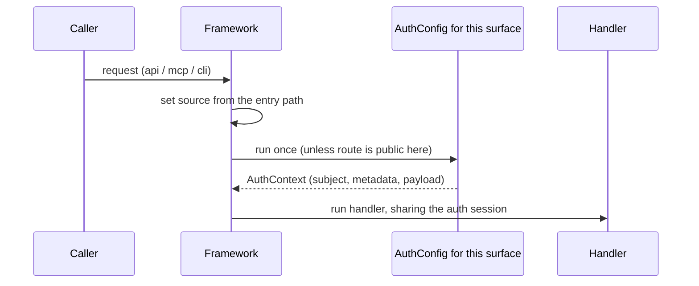

# Auth Model

Quater authenticates a request **once**, with the one authenticator that covers
the surface the request arrived on. Authentication is configured on the app as a
list of `AuthConfig` objects; routes carry no auth of their own.

## Prerequisites

Read [HTTP, MCP, and CLI Surfaces](/en/dev/surfaces). If you expose tools or
actions, read [Security](/en/dev/security) before deployment.

## The Rule

You hand the app a list of `AuthConfig` objects. Each one covers one or more surfaces
(`api`, `mcp`, `cli`). Exactly one runs per request, chosen by
`request.context.source` — the surface the framework determined from the entry
path, never from a caller header.

```python
from quater import AuthConfig, AuthContext, Quater, Request


async def authenticate(request: Request) -> AuthContext | None:
    if request.headers.get("authorization") != "Bearer demo-token":
        return None
    return AuthContext(subject="user_123", metadata={"scope": "orders:read"})


app = Quater(auth=[AuthConfig(authenticate, surfaces=["api", "mcp", "cli"])])


@app.get("/me", tool=True, cli=True, description="Current user.")
async def me(request: Request) -> dict[str, object]:
    assert request.auth is not None
    return {"subject": request.auth.subject, "source": request.context.source}
```

The authenticator receives the real `Request` and returns an `AuthContext`
(returning `None`, or anything that is not an `AuthContext`, denies the
request). Do cheap checks first, then call
`await request.resolve(session_resource)` only when auth needs a resource. The
handler can inject that same resource through
`Annotated[T, session_resource]`. The resolved value shares the request's
resource scope, so a session auth opens to verify the caller is the **same**
session the handler later injects — no second connection, no double lookup.

Sharing is by resource identity: reuse a single module-level `Resource` in both
the authenticator and the handler's `Annotated` alias. Two separate `Resource`
objects, even with the same provider, are two resources and open two sessions —
see [Resources and Injection](./resources#resource-lifetimes).

::: note Validation timing
Resources injected into handlers are validated when routes compile. A resource
used only through `await request.resolve(resource)` is validated when it is
first resolved. Reusing that same resource in a handler alias, or in another
compiled resource graph, gives you startup validation too.
:::



## Surface Auth, `public` To Opt Out

Once a surface has an `AuthConfig`, every route on that surface is protected. Opt a
route out with `public`:

- `public=True` — open on **every** surface the route is exposed on.
- `public=["mcp"]` (or any subset of `api`/`mcp`/`cli`) — open only on the named
  surfaces; the rest stay protected.

```python
@app.get("/health", public=True)                 # open everywhere it is exposed
async def health() -> dict[str, bool]:
    return {"ok": True}


@app.get("/status", tool=True, public=["mcp"], description="Public status.")
async def status() -> dict[str, bool]:            # open to agents, protected on HTTP
    return {"ok": True}
```

`public` is the developer's explicit choice and works the same on every surface.
You decide what to protect and where: a surface with no `AuthConfig` is public.
If that public surface is `mcp` or `cli`, Quater logs the exposed route names at
startup. A route left public on an agent surface is called out too — Quater
warns, it does not guess.

## Reading The Loaded User: `payload`

`AuthContext` has a typed `payload` slot. Load your user once in the
authenticator, hand it back through `payload`, and read it in handlers through a
small resource — with no second query:

```python
from typing import Annotated, cast
from quater import AuthConfig, AuthContext, HTTPError, Quater, Request, Resource

SessionDep = Annotated[Session, db_session]


async def authenticate(request: Request) -> AuthContext:
    token = request.headers.get("authorization")
    if token is None:
        raise HTTPError("Unauthorized", status_code=401)
    session = await request.resolve(db_session)
    user = await user_from_token(session, token)
    if user is None:
        raise HTTPError("Unauthorized", status_code=401)
    return AuthContext(subject=str(user.id), metadata={"role": user.role}, payload=user)


async def current_user(request: Request) -> User:
    assert request.auth is not None
    return cast(User, request.auth.payload)


CurrentUser = Annotated[User, Resource(current_user)]


@app.get("/orders/{id}", tool=True, cli=True, description="Read one order.")
async def get_order(id: str, user: CurrentUser, session: SessionDep) -> dict:
    if user.role != "admin":
        raise HTTPError("Forbidden", status_code=403)
    ...
```

`AuthContext` returns the framework identity, not your app's `User` directly, so
the framework never depends on your domain types. Authorization (roles,
ownership) stays in your handler or service, where it has the data.

## What Runs When

For every request, the framework sets `source` from the entry path, then runs
the one `AuthConfig` for that surface. Calls that target a route, such as
`tools/call` and remote CLI action calls, can skip that authenticator only when
the matched route is public on that surface. MCP and remote CLI read just the
routing bits — the tool or action name, bounded by the body-size limit, with no
argument binding — before auth, so the authenticator sees
`request.context.action_name`/`tool_name`, and remote CLI reaches parity with
MCP. Discovery (`tools/list`, the action manifest) is protected by the same
surface `AuthConfig`; if no `AuthConfig` covers that surface, discovery is public
too.

MCP `initialize` is not a login. Quater does not create an MCP session from it;
every later `tools/list` and `tools/call` must carry valid auth again.

## Auth And Approval

Auth identifies the caller. Approval confirms one sensitive operation should run
for that caller and exact argument set. Use `needs_approval=True` for dangerous
mutations exposed through MCP or CLI:

```python
@app.patch(
    "/orders/{order_id}/status",
    tool=True,
    cli=True,
    needs_approval=True,
    description="Update one order status.",
)
async def update_order_status(order_id: str, status: str) -> dict[str, str]:
    return {"order_id": order_id, "status": status}
```

## What Can Go Wrong

`401 Unauthorized`
: The authenticator returned `None` (or raised). Check the token and header name.

A surface's routes are unexpectedly open
: No `AuthConfig` covers that surface, so its exposed routes are public. Every surface
  behaves the same here — `tool=True`/`cli=True` routes are not special — so this
  is allowed. If the surface is `mcp`, `/mcp`, `/mcp/docs`, `initialize`,
  `tools/list`, and `tools/call` are available without authentication. If the
  surface is `cli`, action discovery and action calls are available without
  authentication. Quater logs it loudly at startup (`No AuthConfig covers the 'mcp'
  surface; exposed routes are public: ...`). Cover it with
  `AuthConfig(fn, surfaces=[...])`, or keep that surface public deliberately.

MCP worked during `initialize` but failed later
: Send the token on every MCP request. `initialize` does not create a session.

`needs_approval requires action_approval`
: A sensitive MCP or CLI operation exists without an approval hook.

## Migrating From Surface Hooks

The previous `mcp_auth=`/`cli_auth=` app hooks and per-route `auth=` were
removed. Move each into the matching surface's `AuthConfig`:

```python
# before
app = Quater(mcp_auth=authenticate, cli_auth=authenticate)

@app.get("/orders/{id}", tool=True, cli=True, auth=authenticate)
async def get_order(id: str): ...

# after
app = Quater(auth=[AuthConfig(authenticate, surfaces=["api", "mcp", "cli"])])

@app.get("/orders/{id}", tool=True, cli=True)     # protected on configured surfaces
async def get_order(id: str): ...
```

`AuthRequest` is gone — authenticators now take the real `Request`. Routes that
were public simply drop their `auth=`; mark them `public=True` only if an `AuthConfig`
now covers their surface.

## Also See

- [Security](/en/dev/security): production security details.
- [MCP Tools](/en/dev/mcp): MCP auth behavior.
- [Actions and CLI](/en/dev/actions): CLI auth and approval flows.
