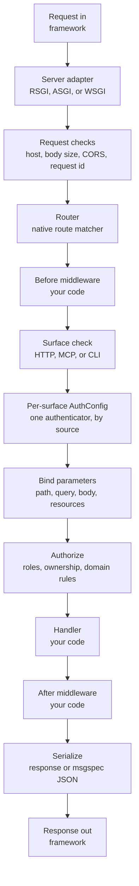
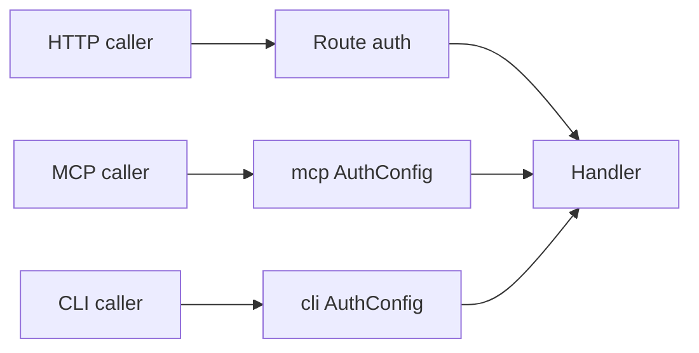

# Quater Manual

This manual explains how Quater helps you build Python backends that people can
use through normal APIs and AI agents can operate through explicit tools and
actions.

## Prerequisites

You should know async Python, HTTP handlers, and basic type annotations. You do
not need prior MCP knowledge; the [MCP guide](/en/dev/mcp) starts with the
protocol model.

## The Short Version

Quater is for backends that need to serve people and services through normal
APIs, while also exposing selected views directly to AI agents and
MCP clients.

You declare a route, then opt it into the surfaces you want:

- HTTP by declaring the route.
- MCP by adding `tool=True`.
- CLI by adding `cli=True`.

That keeps application logic in one place instead of spreading it across API
routes, tool wrappers, scripts, and internal-only shortcuts.

Direct backend access does not mean broad backend access. Quater keeps each
surface behind its own boundary: one `AuthConfig` per surface identifies the
caller, and handler/service code decides whether that caller can run the
operation.

Read [Why Quater Exists](/en/dev/why-quater) for the full problem statement
and design motivation.

### Non-goals

Quater does not ship an ORM, a template engine, a background worker, or a user
account system. It does not try to recreate Django/FastAPI/Flask. It also does not expose every
Starlette or ASGI primitive directly; ASGI and WSGI exist for compatibility.

### Who It Is For

Use Quater when you build API services where humans, agents, and MCP clients need
controlled access to the same backend operations. It fits teams that care about
typed handlers, generated schemas, explicit auth, AI-readable metadata,
operational safety, and low request overhead.


## How The Docs Are Organized

The docs are split by how a developer learns the framework:

- [Quickstart](/en/dev/quickstart) gets a working app running.
- [Why Quater Exists](/en/dev/why-quater) explains the problem behind the
  framework.
- Core concepts explain [routes](/en/dev/routes-handlers),
  [surfaces](/en/dev/surfaces), [auth](/en/dev/auth-model),
  [resources](/en/dev/resources), and
  [middleware](/en/dev/middleware-errors).
- Guides cover [MCP](/en/dev/mcp), [Actions and CLI](/en/dev/actions),
  [Testing](/en/dev/testing), [Deployment](/en/dev/deployment), and
  [Security](/en/dev/security).
- [Reference](/en/dev/reference/) gives exact signatures and defaults.
- Project notes cover [stability](/en/dev/stability),
  [release notes](/en/dev/changelog), and
  [known limitations](/en/dev/known-limitations).

Read the guides first when learning. Use the reference when you already know
which object or option you need.

## Request Lifecycle

Hosted HTTP, MCP, and remote CLI calls enter through the server adapter. Local
CLI imports your app and enters after the network layer.



Route groups do not add another router at request time. Quater flattens group
prefixes, middleware, metadata, and resources when routes compile.

Every protected request runs the AuthConfig for the surface it entered through.
Authorization stays in your handler or service so it can use the loaded domain
data.

## One Handler, Three Surfaces

```python
from quater import AuthConfig, AuthContext, Quater, Request


async def authenticate(ctx: Request) -> AuthContext | None:
    if ctx.headers.get("authorization") != "Bearer demo-token":
        return None
    return AuthContext(subject="demo-user")


app = Quater(auth=[AuthConfig(authenticate, surfaces=["api", "mcp", "cli"])])


@app.get(
    "/orders/{order_id}",
    tool=True,
    cli=True,
    description="Fetch one order by id.",
)
async def get_order(order_id: str, request: Request) -> dict[str, object]:
    assert request.auth is not None
    return {
        "order_id": order_id,
        "subject": request.auth.subject,
        "source": request.context.source,
        "entrypoint": request.context.entrypoint,
    }
```

Expected HTTP output:

```json
{
  "order_id": "ord_1001",
  "subject": "demo-user",
  "source": "api",
  "entrypoint": "server"
}
```

Expected local CLI output:

```json
{
  "order_id": "ord_1001",
  "subject": "demo-user",
  "source": "cli",
  "entrypoint": "local"
}
```

The three surfaces converge on the same handler, but auth does not collapse:



## Reading Path

1. [Quickstart](/en/dev/quickstart): install Quater, run an app, call HTTP,
   MCP, and CLI.
2. [Why Quater Exists](/en/dev/why-quater): understand the human-and-agent
   backend model.
3. [Routes and Handlers](/en/dev/routes-handlers): learn how Quater maps
   calls to your code.
4. [HTTP, MCP, and CLI Surfaces](/en/dev/surfaces): understand the access
   paths.
5. [Auth Model](/en/dev/auth-model): review the layered auth rules.
6. [Resources and State](/en/dev/resources): add database sessions and other
   per-request values.
7. [MCP](/en/dev/mcp) and [Actions and CLI](/en/dev/actions): expose
   selected operations to agents and MCP clients.
8. [Security](/en/dev/security), [Deployment](/en/dev/deployment), and
   [Testing](/en/dev/testing): prepare real apps.
9. [Reference](/en/dev/reference/): look up signatures and exact defaults.

## What Can Go Wrong

`No AuthConfig covers the 'mcp' surface; exposed routes are public: ...` (startup warning)
: At least one MCP tool is exposed while the `mcp` surface has no `AuthConfig`, so those tools are callable without authentication. Cover the surface with `AuthConfig(fn, surfaces=["mcp"])`, or keep it public deliberately.

`No AuthConfig covers the 'cli' surface; exposed routes are public: ...` (startup warning)
: At least one CLI action is exposed while the `cli` surface has no `AuthConfig`, so those actions are callable without authentication. Cover the surface with `AuthConfig(fn, surfaces=["cli"])`, or keep it public deliberately.

`needs_approval requires tool=True or cli=True`
: Use `needs_approval=True` only on routes exposed as MCP tools or CLI actions.

`Dynamic routes at the same position must use the same name and converter`
: Rename the conflicting path variable or split the route pattern.

## Known Limitations

See [Known Limitations](/en/dev/known-limitations) for the current pre-release
gaps, including WebSockets, built-in ORM support, background jobs, rate limiting,
MCP streaming, and OpenAPI depth.

## Also See

- [Quickstart](/en/dev/quickstart): build the first working app.
- [Why Quater Exists](/en/dev/why-quater): understand the problem Quater is
  built around.
- [Security](/en/dev/security): understand the auth boundaries shown above.
- [Reference](/en/dev/reference/): check exact signatures and defaults.
