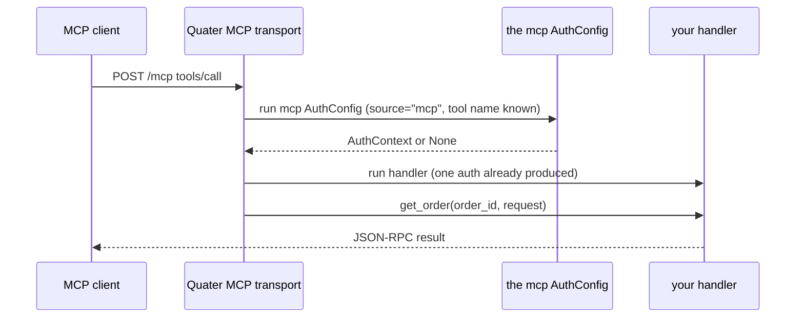

# MCP Tools

This page explains how Quater exposes selected backend operations as MCP tools
for AI agents.

## Prerequisites

Read the [Quickstart](/en/dev/quickstart) and create an app with an `AuthConfig` covering `"mcp"`.
You should decide the handler-level authorization rules before exposing sensitive tools.

## What MCP Means Here

MCP (Model Context Protocol) is a protocol that lets AI clients discover tools
and call them with structured arguments. Quater exposes route-backed tools over
HTTP so an agent can call backend operations without a separate tool server.
Read the protocol background at [modelcontextprotocol.io](https://modelcontextprotocol.io/).

The important idea is directness with boundaries. An agent should not need to
click through a frontend to fetch an order, update a workflow, or run an
approved backend action. It should call a described tool with typed inputs, and
your app should decide whether that call is allowed.

Quater does not make every route a tool. You opt in with `tool=True`, write a
description, and protect the MCP surface with an `AuthConfig` covering `"mcp"`.

## A Runnable Tool

```python
from quater import AuthConfig, AuthContext, Quater, Request


async def authenticate(ctx: Request) -> AuthContext | None:
    if ctx.headers.get("authorization") != "Bearer mcp-token":
        return None
    return AuthContext(subject="agent_123")


app = Quater(
    auth=[AuthConfig(authenticate, surfaces=["mcp"])],
    mcp_allowed_origins=["https://client.example"],
)


@app.get(
    "/orders/{order_id}",
    tool=True,
    description="Fetch one order by id.",
)
async def get_order(order_id: str, request: Request) -> dict[str, object]:
    assert request.auth is not None
    return {"order_id": order_id, "subject": request.auth.subject}
```

The route still works as HTTP:

```text
GET /orders/ord_1001
```

It also appears in MCP `tools/list`.

## Auth Layering

MCP auth and authorization have separate jobs:

- The `mcp` `AuthConfig` protects `initialize`, `tools/list`, `tools/call`, and `/mcp/docs`.
- Handler or service authorization decides whether the authenticated caller may run the selected operation.

::: warning No MCP AuthConfig means public MCP
If no `AuthConfig` covers `"mcp"`, Quater does not challenge MCP requests. The
MCP surface is public, including `/mcp`, `/mcp/docs`, `initialize`, `tools/list`,
and `tools/call`. `tools/list` reveals every route exposed with `tool=True`, and
`tools/call` can run those tools. Quater logs the exposed tool names at startup
so the public surface is visible.
:::

Quater checks MCP auth on each HTTP request. It does not authenticate once during
`initialize` and then reuse that result for later tool calls.



If the `mcp` authenticator returns `None`, the call fails before tool dispatch.
Authorization inside the handler can still reject the selected operation after
arguments are bound.

## Endpoint And Client Config

The MCP endpoint is fixed:

```text
POST /mcp
```

For a hosted app at `https://api.example.com`, configure the MCP URL as:

```text
https://api.example.com/mcp
```

When the MCP surface is protected, bearer auth must go on every HTTP request,
not only on `initialize`:

```json
{
  "mcpServers": {
    "store": {
      "url": "https://api.example.com/mcp",
      "headers": {
        "Authorization": "Bearer mcp-token"
      }
    }
  }
}
```

`initialize` is not a login. Quater does not create a server-side session from
it. If the protected surface's token expires, the next request fails with
`401 Unauthorized`.

::: tip Keep authorization close to the data
The `mcp` `AuthConfig` decides whether the caller may use the MCP surface.
Authorization decides whether that caller can run the selected backend operation.
Keep roles, ownership, and other domain checks in the handler or service.
:::

## Request Flow

```mermaid
flowchart TB
    request["framework: POST /mcp"]
    origin["framework: origin check"]
    auth["per-surface AuthConfig"]
    dispatch["framework: JSON-RPC dispatch"]
    list["framework: tools/list"]
    call["framework: tools/call"]
    bind["framework: bind arguments"]
    approval["your code: approval hook when needed"]
    handler["your code: handler"]
    result["framework: JSON-RPC response"]

    request --> origin --> auth --> dispatch
    dispatch --> list --> result
    dispatch --> call --> bind --> approval --> handler --> result
```

Browser MCP clients also need `mcp_allowed_origins`. If you omit it and CORS has
exact origins, Quater reuses those exact origins. A CORS wildcard does not allow
browser-based MCP calls.

## Tool Schemas

Quater generates `inputSchema` from the route's path, query, header, cookie, and
body parameters. `Form` fields appear as scalar tool arguments. It excludes
injected `Resource` parameters because those values belong to the app, not the
caller.

For a tool call, Quater builds a synthetic handler request from the MCP tool
arguments. This applies regardless of how the handler reads the request:

- `Header()` and `Cookie()` parameters only see values passed in `params.arguments`.
- If the handler injects `Request` directly and reads `request.headers`,
  `request.cookies`, or `await request.body()`, it still sees the synthetic
  request — not the outer MCP transport request.

The outer MCP transport headers, such as `Authorization`, `Cookie`,
`Content-Length`, `Mcp-Protocol-Version`, `Origin`, and request ids, are used by
the MCP endpoint and are not copied into the handler request. Use `request.auth`
for the authenticated caller and `request.context` for source and tool metadata.

```json
{
  "name": "get_order",
  "description": "Fetch one order by id.",
  "inputSchema": {
    "type": "object",
    "properties": {
      "order_id": {"type": "string"}
    },
    "required": ["order_id"],
    "additionalProperties": false
  }
}
```

Descriptions are required for `tool=True` routes. Use `description=` or the
first line of the handler docstring. Tool descriptions are visible to agents, so
write them as instructions about when the tool should be used.

Routes with `File` parameters cannot be MCP tools in this release. File upload
through an agent needs a separate file-reference design and tighter trust rules,
so Quater fails at startup instead of exposing a tool schema that cannot run
safely.

## Approval-Protected Tools

Use `needs_approval=True` when auth alone should not run an operation.

```python
from quater import ApprovalRequest, AuthConfig, AuthContext, Quater


async def authenticate(ctx: Request) -> AuthContext | None:
    if ctx.headers.get("authorization") != "Bearer mcp-token":
        return None
    return AuthContext(subject="agent_123")


async def approve_action(ctx: ApprovalRequest) -> bool:
    return ctx.token == "approve-ord_1001"


app = Quater(auth=[AuthConfig(authenticate, surfaces=["mcp"])], action_approval=approve_action)


@app.patch(
    "/orders/{order_id}/status",
    tool=True,
    needs_approval=True,
    description="Update an order status.",
)
async def update_order_status(order_id: str, status: str) -> dict[str, str]:
    return {"order_id": order_id, "status": status}
```

Send the approval token in MCP `_meta`:

```json
{
  "jsonrpc": "2.0",
  "id": 3,
  "method": "tools/call",
  "params": {
    "name": "update_order_status",
    "arguments": {
      "order_id": "ord_1001",
      "status": "shipped"
    },
    "_meta": {
      "approvalToken": "approve-ord_1001"
    }
  }
}
```

If the token is missing, Quater returns a JSON-RPC error with
`data.code == "approval_required"` and includes `arguments_hash`.

## MCP Docs

`GET /mcp/docs` renders a human-readable page with:

- tool name
- description
- route method and path
- pretty JSON input and output schema
- example `tools/call` payload

MCP clients should use `tools/list`. Humans should use `/mcp/docs`.

Disable the page while keeping `/mcp` available:

```python
app = Quater(auth=[AuthConfig(authenticate, surfaces=["mcp"])], mcp_docs_path=None)
```

## Auditing

Pass `mcp_audit` to receive redacted tool-call events:

```python
from quater import ToolAuditEvent


async def audit(event: ToolAuditEvent) -> None:
    print(event.tool_name, event.subject, event.success)


app = Quater(auth=[AuthConfig(authenticate, surfaces=["mcp"])], mcp_audit=audit)
```

Quater redacts argument values before the hook sees them. If the audit hook
raises, Quater returns a JSON-RPC internal error for that tool call. It does not
silently hide audit failures.

## What Can Go Wrong

`No AuthConfig covers the 'mcp' surface; exposed routes are public: ...` (startup warning)
: At least one MCP tool is exposed while the `mcp` surface has no `AuthConfig`, so `/mcp`, `/mcp/docs`, `initialize`, `tools/list`, and `tools/call` are available without authentication. Cover the surface with `AuthConfig(fn, surfaces=["mcp"])`, or keep it public deliberately.

`Invalid MCP Origin`
: Add the browser origin to `mcp_allowed_origins`.

`Unsupported protocol version`
: Send a supported `MCP-Protocol-Version` header or omit it and let Quater use
  its default.

`Tool not found`
: Check the route has `tool=True` and a description.

`Routes with File parameters cannot be exposed as MCP tools`
: Keep upload routes HTTP-only today, or split the upload from the operation an
  agent should call.

`approval_required`
: Send `_meta.approvalToken` or remove `needs_approval=True` from that route.

## Also See

- [Actions and CLI](/en/dev/actions): use the same approval hook for CLI.
- [Security](/en/dev/security): review MCP origin validation and token rules.
- [Testing](/en/dev/testing): test tools with `client.mcp`.
- [Reference: Auth](/en/dev/reference/auth): inspect `AuthConfig`, `AuthContext`, and
  `ApprovalRequest`.
