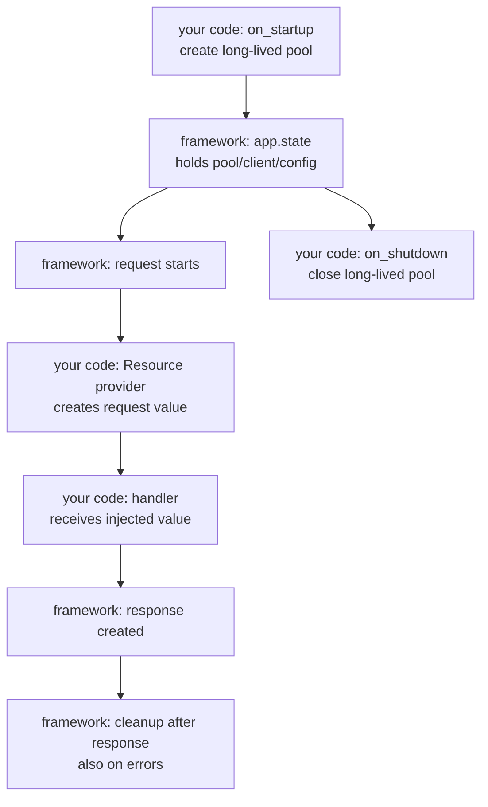

# Resources And Injection

This page explains `app.state` and request-scoped `Resource` injection.

## Prerequisites

Read [Quickstart](/en/dev/quickstart) and [Public API](/en/dev/api). You
should know async context managers if you plan to inject database sessions.

## Why This Exists

Real handlers need values that should never come from the client: database
sessions, cache clients, tenant objects, feature flags, and API clients.

Quater keeps those values explicit:

- Long-lived objects live on `app.state`.
- Per-request values use `Resource`.
- Routes opt in by naming the `Resource`, either in the decorator's
  `inject={...}` map or in the parameter's type annotation.

Quater does not build a hidden dependency graph. A reader can see every injected
parameter at the route — in the decorator's `inject` map or in the handler
signature — and know which values come from the app.

## Resource Lifecycle



Cleanup runs after response creation. For streaming responses, Quater keeps the
resource alive until the response body has been consumed by the adapter.

## A Runnable Example

```python
from collections.abc import AsyncIterator

from quater import Quater, Request, Resource


class OrderStore:
    async def get_order(self, order_id: str) -> dict[str, object]:
        return {"id": order_id, "status": "paid"}

    async def close(self) -> None:
        pass


app = Quater()


@app.on_startup
async def startup() -> None:
    app.state.store = OrderStore()


@app.on_shutdown
async def shutdown() -> None:
    await app.state.store.close()


async def store_resource(request: Request) -> AsyncIterator[OrderStore]:
    yield request.app.state.store


store = Resource(store_resource, name="store")


@app.get("/orders/{order_id}", inject={"store": store})
async def get_order(order_id: str, store: OrderStore) -> dict[str, object]:
    return await store.get_order(order_id)
```

Expected response:

```json
{
  "id": "ord_1001",
  "status": "paid"
}
```

## Provider Forms

A provider can accept no arguments:

```python
async def settings_resource() -> dict[str, str]:
    return {"region": "us-east-1"}
```

Or it can accept the current `Request`:

```python
async def tenant_resource(request: Request) -> str:
    return request.headers.get("x-tenant-id", "public")
```

It can return:

- a plain value
- an awaitable value
- a sync context manager
- an async context manager
- a sync generator that yields once
- an async generator that yields once

Database sessions usually use an async generator:

```python
from collections.abc import AsyncIterator

from quater import Request


async def session_resource(request: Request) -> AsyncIterator[DatabaseSession]:
    async with request.app.state.database.session() as session:
        yield session
```

## Route Usage

```python
db_session = Resource(session_resource, name="db_session")


@app.post("/orders", inject={"session": db_session})
async def create_order(order: CreateOrder, session: DatabaseSession) -> dict[str, str]:
    created = await session.create_order(order)
    return {"id": created.id}
```

The injected `session` does not appear in:

- OpenAPI request parameters
- MCP input schemas
- CLI action schemas
- HTTP path, query, header, cookie, or body binding

That keeps app-owned objects away from untrusted caller input.

## Two Ways To Wire A Resource

A `Resource` is bound to a handler parameter by name. You can express that
binding in two places. Both produce the same binding, and both keep the
parameter out of every caller-facing schema.

### In the decorator (`inject={...}`)

The `inject` map keys each resource to a parameter name:

```python
@app.post("/orders", inject={"session": db_session})
async def create_order(order: CreateOrder, session: DatabaseSession) -> dict[str, str]:
    ...
```

The parameter (`session: DatabaseSession`) is a plain typed parameter; the
decorator says where its value comes from. This is the only form that a
[`RouteGroup`](#groups) can share across several routes, so prefer it when a
whole feature needs the same resource.

### In the type annotation (`Annotated[T, resource]`)

Put the `Resource` in the parameter's annotation. The parameter type is still
`T`; the resource rides along as annotation metadata that Quater reads at route
compilation:

```python
@app.post("/orders")
async def create_order(
    order: CreateOrder,
    session: Annotated[DatabaseSession, db_session],
) -> dict[str, str]:
    ...
```

This keeps the value and its provider next to the parameter, and it lets you
define a reusable alias once and share it across handlers — the same shape you
may know from other frameworks:

```python
from typing import Annotated

SessionDep = Annotated[DatabaseSession, db_session]


@app.get("/orders/{order_id}")
async def get_order(order_id: str, session: SessionDep) -> dict[str, str]:
    ...


@app.post("/orders")
async def create_order(order: CreateOrder, session: SessionDep) -> dict[str, str]:
    ...
```

Because the annotation type stays `DatabaseSession` and the parameter has no
default, this form type-checks cleanly under strict tools with no cast or
`# type: ignore`.

Define the `Resource` (and any `Annotated` alias) at module scope so Quater can
resolve the annotation when it compiles the route.

### Rules

- Declare a resource in **one** place per parameter. Naming the same parameter in
  both `inject={...}` and its annotation is rejected at route compilation.
- A `Resource` cannot go in a parameter's **default** value
  (`session: DatabaseSession = db_session`). Use `inject={...}` or the
  annotation instead; the default form is rejected with a clear error.

## Groups

Use a [`RouteGroup`](/en/dev/reference/application#symbol-routegroup) when
several routes in one feature need the same resource:

```python
from quater import Quater, Resource, RouteGroup

app = Quater()
orders = RouteGroup(prefix="/orders", inject={"session": db_session})


@orders.get("/{order_id}")
async def get_order(order_id: str, session: DatabaseSession) -> dict[str, object]:
    order = await session.fetch_order(order_id)
    return {"id": order.id}


app.include(orders)
```

Quater flattens group resources into the final route when the group is included.
It does not resolve resources during route matching.

## MCP And CLI

Resources work the same through HTTP, MCP, local CLI, and remote CLI:

```python
@app.get(
    "/orders/{order_id}",
    tool=True,
    cli=True,
    inject={"session": db_session},
    description="Fetch one order.",
)
async def get_order(order_id: str, session: DatabaseSession) -> dict[str, object]:
    order = await session.fetch_order(order_id)
    return {"id": order.id, "status": order.status}
```

The generated MCP and CLI schemas include `order_id`, not `session`.

## What Can Go Wrong

`Injected parameter 'session' does not exist on the handler`
: The `inject` key must match a handler parameter name.

`Injected parameter 'session' cannot use a parameter marker`
: Do not combine `Resource` injection with `Path`, `Query`, `Body`, `Header`, or
  `Cookie`.

`Resource provider parameter must be named 'request' or typed as Request`
: Rename the provider argument to `request` or annotate it as `Request`.

`Resource providers cannot use *args or **kwargs`
: Give the provider either zero parameters or one request parameter.

`Resource provider 'db_session' did not yield a value`
: A generator provider must yield exactly one value.

`Resource provider 'db_session' yielded more than once`
: Use one `yield`, then cleanup after it.

`Duplicate injected parameter: session`
: A group and a route both define `session` with different `Resource` objects.
  Use the same object or rename one parameter.

`Injected parameter 'session' is declared both in inject= and in its type annotation`
: A parameter names the same resource in the decorator `inject` map and in its
  `Annotated[...]` metadata. Keep one.

`Resource for 'session' must be declared in inject= or in the type annotation (Annotated[T, resource]), not as a default value`
: A `Resource` was placed in a parameter's default value. Move it into the
  `inject` map or the parameter's annotation.

`Only one resource is supported in a type annotation`
: A parameter's `Annotated[...]` metadata lists more than one `Resource`. Use a
  single resource per parameter.

## Also See

- [Public API](/en/dev/api): see `app.state`, lifespan hooks, and `inject`.
- [Testing](/en/dev/testing): test resource cleanup through `TestClient`.
- [Reference: Resources](/en/dev/reference/resources): inspect the exact
  `Resource` signature.
- [Deployment](/en/dev/deployment): understand how workers affect app state.
