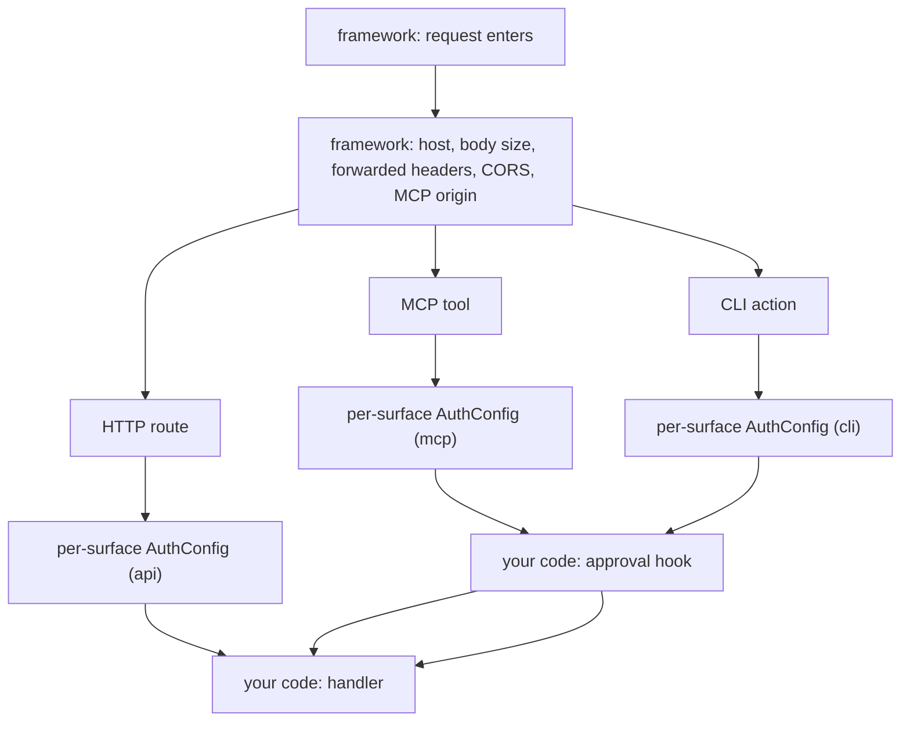

# Security

This page documents Quater's security boundaries, defaults, and the places where
your application owns the policy.

## Prerequisites

Read [Quickstart](/en/dev/quickstart), [Actions and CLI](/en/dev/actions),
and [MCP](/en/dev/mcp) if your app exposes tools or actions.

## Security Model

Quater checks unsafe request properties before user code runs. Auth then runs once
for the request's surface; authorization stays in your handler or service code.



Quater does not ship a user system. Your auth hooks decide who the caller is and
what scopes they have.

## Auth

An authenticator receives the `Request` and returns `AuthContext` or `None`:

```python
from quater import AuthConfig, AuthContext, Quater, Request


async def authenticate(ctx: Request) -> AuthContext | None:
    if ctx.headers.get("authorization") != "Bearer demo-token":
        return None
    return AuthContext(subject="user_123", metadata={"scope": "orders:read"})


app = Quater(auth=[AuthConfig(authenticate, surfaces=["api"])])


@app.get("/me")
async def me(request: Request) -> dict[str, str]:
    assert request.auth is not None
    return {"subject": request.auth.subject}
```

Missing or rejected auth returns:

```text
401 Unauthorized
Unauthorized
```

Routes are protected by default on every surface they are exposed on, by the one
`AuthConfig` that covers each surface. A route is reachable without auth only where you
mark it `public` (`public=True` for every exposed surface, or `public=["mcp", ...]`
for named ones).

::: warning A route is only as safe as its weakest surface
A route exposed on several surfaces is gated by each surface's `AuthConfig`
independently. Keep every exposed surface's authenticator strong, and reach for
`public` deliberately — making an agent surface public is logged loudly at
startup.
:::

::: tip Reject before you open the pool
Check the cheap thing first. An authenticator that reads only the `Request`
header rejects a no-token request before any database session opens, so a
bad-token flood can't drain the connection pool. When auth needs the database,
call `await request.resolve(SessionDep)` only after the token/header shape has
passed cheap validation, where `SessionDep` is the same `Annotated[T, resource]`
alias the handler injects. Authenticator resource parameters are rejected at
startup because they would open resources too early.
:::

## Surface Auth

The `mcp` `AuthConfig` protects:

- `POST /mcp`
- `GET /mcp/docs`
- `initialize`
- `tools/list`
- `tools/call`

The `cli` `AuthConfig` protects:

- local action discovery
- local action execution
- `GET /.well-known/quater-actions.json`
- `POST /__quater__/actions/call`

Route-level `auth=` no longer exists. Put identity checks in the surface
`AuthConfig`; put roles, ownership, and other authorization checks in the handler
or service where the domain data is available.

## Approval

Approval is not auth. Auth identifies the caller. Approval confirms one
sensitive operation should run for that caller and that exact argument set.

```python
from quater import ApprovalRequest


async def approve_action(ctx: ApprovalRequest) -> bool:
    return ctx.auth is not None and ctx.token == "approve-ord_1001"
```

The approval request includes:

- action name
- SHA-256 argument hash
- submitted approval token
- authenticated subject when available
- request context

Quater computes the hash from the action name and canonical JSON arguments.
Object key ordering does not change it.

## Hosts And Proxies

Use `allowed_hosts` for deployed apps:

```python
app = Quater(allowed_hosts=["api.example.com"])
```

In strict mode, empty `allowed_hosts` accepts local development hosts only:

- `localhost`
- `127.0.0.1`
- `::1`
- `testserver`

`app.validate_production()` rejects missing `allowed_hosts` and rejects
`allowed_hosts=["*"]`.

Use `trusted_proxies` only for proxy IPs or CIDR ranges you control:

```python
app = Quater(
    allowed_hosts=["api.example.com"],
    trusted_proxies=["10.0.0.0/8"],
)
```

Quater ignores forwarded host and scheme headers unless the immediate client IP
matches `trusted_proxies`.

## Body Limits

`max_body_size` defaults to `2mb` and applies before JSON parsing or form
parsing:

```python
app = Quater(
    max_body_size="2mb",
    max_form_parts=1000,
    max_form_field_size="1mb",
    max_file_size="2mb",
)
```

If `Content-Length` exceeds the limit, Quater rejects the request before reading
the stream. If no content length exists, adapters enforce the limit while
reading the body.

Form and file limits apply after the request body fits inside `max_body_size`.
Set them through constructor options or environment variables such as
`QUATER_MAX_FILE_SIZE=8mb`.

Expected error:

```text
413 Payload Too Large
Payload Too Large
```

## Response Headers

Strict mode adds baseline headers to normal responses and framework errors:

- `X-Content-Type-Options: nosniff`
- `Referrer-Policy: same-origin`
- `X-Frame-Options: DENY`
- `Strict-Transport-Security` on HTTPS requests
- `Content-Security-Policy` when configured

Use `security="off"` only in controlled local or embedded environments.

## CORS And MCP Origins

CORS controls browser read access. It does not authenticate users.

```python
from quater import CORSConfig, Quater

app = Quater(
    cors=CORSConfig(
        allowed_origins=("https://app.example.com",),
        allowed_headers=("authorization", "content-type"),
        allow_credentials=True,
    )
)
```

If `allowed_headers` is empty, Quater reflects sanitized browser-requested
headers. If you configure headers, Quater only advertises those headers.
Quater advertises common API methods by default. If you register an
extension method with `route("PROPFIND", ...)` and browser clients call it
cross-origin, include that method in `allowed_methods`.

MCP origin validation uses `mcp_allowed_origins` first:

```python
app = Quater(
    mcp_allowed_origins=["https://client.example"],
    auth=[AuthConfig(authenticate, surfaces=["mcp"])],
)
```

If that option is empty and CORS has exact origins, Quater reuses those exact
origins. A CORS wildcard does not allow browser-based MCP calls.

## Signed Cookies

`SignedCookieSigner` signs small cookie values with HMAC. It does not encrypt
them.

```python
from quater import SignedCookieSigner

signer = SignedCookieSigner("new-secret", fallback_secrets=["old-secret"])
cookie_value = signer.sign("user_123")
subject = signer.verify(cookie_value)
```

Use fallback secrets during rotation. Verification uses constant-time signature
comparison.

## Request IDs And Access Logs

Quater validates `x-request-id` before echoing it. Unsafe values are replaced
with generated ids before the handler or access logger sees them.

`access_logger` receives structured metadata after the response is created. It
does not receive request bodies, headers, or query strings.

```python
from quater import AccessLogEvent, Quater


async def log_access(event: AccessLogEvent) -> None:
    print(event.to_dict())


app = Quater(access_logger=log_access)
```

If the access logger raises, Quater suppresses the exception so logging cannot
break the response path. If you need fail-closed audit behavior, use `mcp_audit`
for MCP tool calls.

## What Can Go Wrong

`Invalid Host header`
: Configure `allowed_hosts` or fix the incoming `Host` header.

`Invalid Content-Length header`
: Send a valid non-negative integer content length.

`CORS wildcard origins cannot be used with credentials`
: Use explicit origins when `allow_credentials=True`.

`Invalid MCP Origin`
: Add the client origin to `mcp_allowed_origins`.

`Production safety check failed:`
: Fix each listed item before production startup.

`Route path '/mcp' is reserved by Quater. Choose a different application route.`
: Do not register application routes under Quater protocol paths.

## Also See

- [Deployment](/en/dev/deployment): production checks and server setup.
- [MCP](/en/dev/mcp): MCP auth and origin validation.
- [Actions and CLI](/en/dev/actions): remote action protocol security.
- [Reference: Auth](/en/dev/reference/auth): exact auth and approval types.
