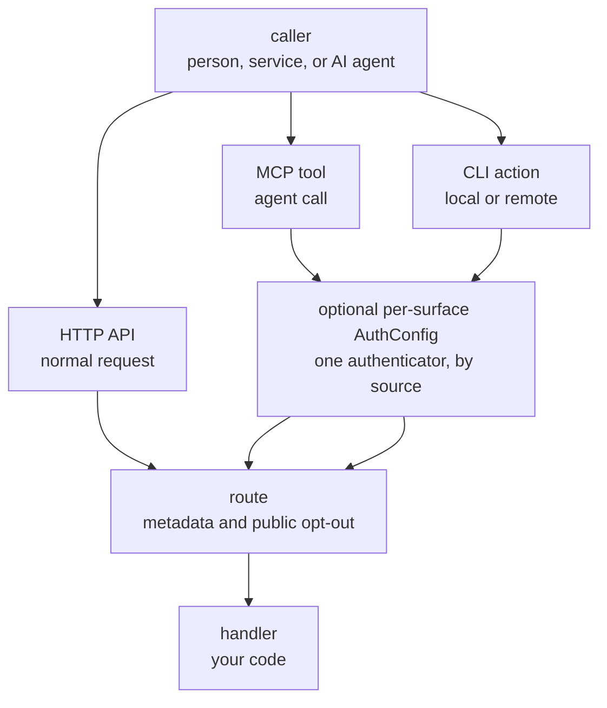

# HTTP, MCP, And CLI Surfaces

This page explains how one Quater route can be reached through HTTP, MCP, and
CLI without turning into three implementations.

## Prerequisites

Read [Why Quater Exists](/en/dev/why-quater) and
[Routes and Handlers](/en/dev/routes-handlers).

## The Model

HTTP is the default surface. If you declare `@app.get(...)`, you have an HTTP
route.

MCP and CLI are opt-in:

- `tool=True` exposes the route as an MCP tool for MCP Clients.
- `cli=True` exposes the route as a CLI action for AI agents.

The surfaces do not share transport auth. A surface is public unless an
`AuthConfig` covers it; once covered, every route exposed on that surface is
private unless the route opts out with `public`.



## One Route, Three Access Paths

```python
from quater import AuthConfig, AuthContext, Quater, Request


async def authenticate(ctx: Request) -> AuthContext | None:
    if ctx.headers.get("authorization") != "Bearer demo-token":
        return None
    return AuthContext(subject="cust_123")


app = Quater(auth=[AuthConfig(authenticate, surfaces=["api", "mcp", "cli"])])


@app.get(
    "/orders/{order_id}",
    tool=True,
    cli=True,
    description="Fetch one order by id.",
)
async def get_order(order_id: str, request: Request) -> dict[str, object]:
    assert request.auth is not None
    return {
        "order_id": order_id,
        "subject": request.auth.subject,
        "source": request.context.source,
        "entrypoint": request.context.entrypoint,
    }
```

HTTP output:

```json
{
  "order_id": "ord_1001",
  "subject": "cust_123",
  "source": "api",
  "entrypoint": "server"
}
```

Local CLI output:

```json
{
  "order_id": "ord_1001",
  "subject": "cust_123",
  "source": "cli",
  "entrypoint": "local"
}
```

MCP returns the same handler result inside a JSON-RPC tool response.

## Argument Parity

For declared handler inputs, Quater keeps the binding contract the same across
HTTP, MCP tools, local CLI, and remote CLI. Path, query, body, header, cookie,
default, and optional parameters should reach the same Python handler values;
when the same invalid value can be represented on each surface, validation
errors should also point at the same declared input.

Unknown extras are intentionally surface-specific. HTTP ignores extra query
params, headers, and cookies because web requests often carry tracking params,
proxy headers, or browser cookies that the handler did not ask for. MCP tools
and CLI actions reject unknown action arguments because those calls are
schema-driven; rejecting extras catches typos, stale clients, and accidental
over-posting.

Middleware and exception handlers also follow the handler, not the transport
wrapper. Global logging, timing, and error-mapping middleware runs around the
real route handler for HTTP, MCP tools, and CLI actions. On MCP and CLI,
middleware sees the handler response before Quater wraps it in the JSON-RPC or
action payload. HTTP-shaped middleware such as cookies, redirects, HTML, or
browser security headers should check `request.context.source` and skip MCP/CLI
when that behavior does not make sense for tool callers.

## When To Use Each Surface

Use HTTP for the product API and service-to-service calls.

Use MCP when an AI agent should discover and call a backend operation with a
structured schema.

Use CLI when an operator or script should run a backend operation locally or
against a hosted app.

## What Can Go Wrong

`No AuthConfig covers the 'mcp' surface; exposed routes are public: ...` (startup warning)
: At least one MCP tool is exposed while the `mcp` surface has no `AuthConfig`, so those tools are callable without authentication. Cover the surface with `AuthConfig(fn, surfaces=["mcp"])`, or keep it public deliberately.

`No AuthConfig covers the 'cli' surface; exposed routes are public: ...` (startup warning)
: At least one CLI action is exposed while the `cli` surface has no `AuthConfig`, so those actions are callable without authentication. Cover the surface with `AuthConfig(fn, surfaces=["cli"])`, or keep it public deliberately.

`needs_approval requires tool=True or cli=True`
: Approval only applies to operations exposed outside normal HTTP.

## Also See

- [MCP Tools](/en/dev/mcp): agent-facing tool details.
- [Actions and CLI](/en/dev/actions): local and remote action details.
- [Auth Model](/en/dev/auth-model): exact auth order across surfaces.
