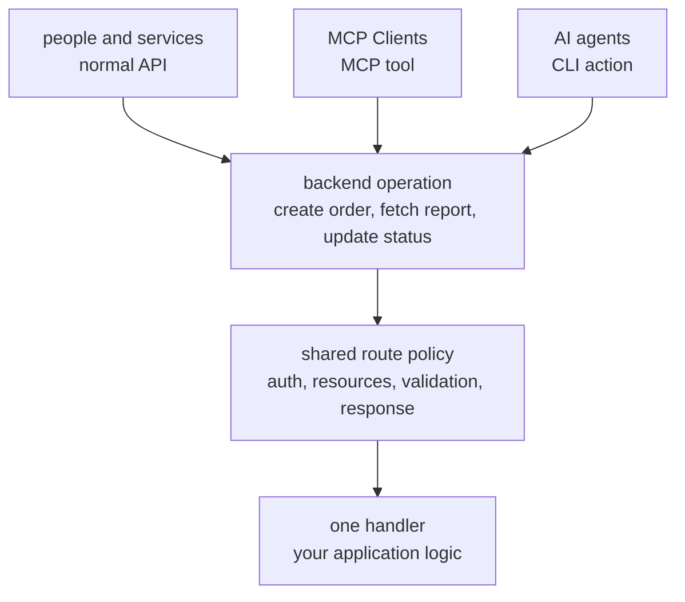

# Why Quater Exists

This page explains the problem Quater is built around before it explains the
API.

## The Shift

Most backend frameworks grew up around the same shape of software: a backend
serves a frontend, and people use that frontend to do work.

That shape still matters. People still need apps, dashboards, admin panels, and
normal APIs. But AI agents are becoming another caller of backend systems. They
need to read data, perform operations, and help run software.

The awkward part is the interface. A screen is a good interface for a person. It
is a slow and fragile interface for an agent. If an agent has to click through
menus and forms to do backend work, the system becomes harder to trust and
harder to operate.

## The Problem

Teams usually patch around this with extra code:

- one endpoint for the app
- one wrapper for an AI tool
- one script for internal operations
- one private shortcut for support or incident work

Those paths start close together, then drift. One path gets new validation. One
path keeps old auth. One path returns a slightly different shape. One path skips
the check that the public API depends on.

That drift is the real problem. It makes the backend harder to reason about.

## What Quater Is Trying To Make

Quater is trying to make the backend itself a safe operating surface.

You still build normal APIs for people and services. When an operation should
also be callable by an AI agent or operator, you opt it into that surface. The
operation keeps one handler, one binding model, one route-level auth policy, and
one place where the application logic lives.

The outside access paths stay separate because they have different security
needs. MCP has its own auth. CLI has its own auth. Sensitive actions can require
approval for one exact argument set.

The result should feel boring in the right way: a normal Python backend that is
also ready for agents and operations.

## What Quater Is Not Trying To Do

Quater is not trying to replace Django/FastAPI/Flask. It does not ship an ORM, migrations,
templates, a user model, or an admin site.

Quater is also not trying to make every backend action available to agents. The
default model is opt-in. You choose which operations become tools or actions.

## What Can Go Wrong

`MCP tools require mcp_auth`
: Quater refuses to expose tools without MCP transport auth. Add
`mcp_auth=...` to `Quater(...)`.

`CLI actions require cli_auth`
: Quater refuses to expose CLI actions without CLI transport auth. Add
`cli_auth=...` to `Quater(...)`.

## Also See

- [HTTP, MCP, and CLI Surfaces](/en/dev/surfaces): how the access paths fit
  together.
- [Auth Model](/en/dev/auth-model): where the auth boundaries run.
- [MCP Tools](/en/dev/mcp): how agents discover and call route-backed tools.
