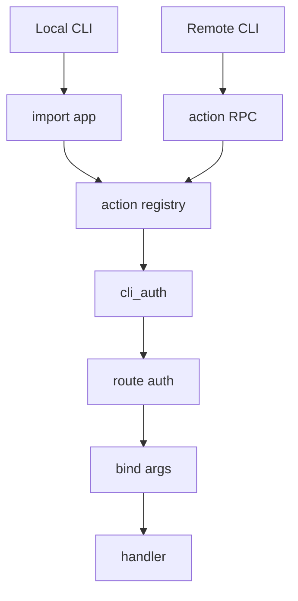

# Actions and CLI

Quater actions are derived from route metadata and can be called outside normal
HTTP while still using the same handler. The CLI and MCP surfaces have their own
transport auth and protocol errors, but the action call reuses handler binding,
route-level auth, response normalization, and the generated input schema.

You opt in one route at a time:

```python
from quater import AuthContext, AuthRequest, Quater, Request


async def authenticate(ctx: AuthRequest) -> AuthContext | None:
    if ctx.headers.get("authorization") != "Bearer admin-token":
        return None
    return AuthContext(subject="admin")


app = Quater(cli_auth=authenticate)


@app.get(
    "/orders/{order_id}",
    cli=True,
    description="Fetch one order by id.",
)
async def get_order(order_id: str, request: Request) -> dict[str, object]:
    assert request.auth is not None
    return {
        "order_id": order_id,
        "subject": request.auth.subject,
        "source": request.context.source,
    }
```

The route is still an HTTP route:

```text
GET /orders/ord_1001
```

It also becomes a Quater action that the CLI can discover and call.

Action descriptions are required. Use `description=` or the first line of the
handler docstring. The description is what people and agents see when they list
or search actions, so write what the action is for, not just what it is named.

::: tip Why actions exist
MCP tools solve one kind of agent access, but teams also need a safe operational
CLI for the same backend workflows. Quater actions give both humans and agents a
single declared operation instead of forcing you to maintain separate admin
scripts, HTTP endpoints, and tool handlers for the same business logic.
:::

## Action Call Flow

Local and remote CLI calls reach the app differently, but after discovery they
both execute through the action registry and the same route handler.



## Local Actions

Local CLI calls import the app and run in the same Python process. They do not
need a running server, but they still go through `cli_auth`.

Set the app import path with `--app`:

```bash
quater --app main:app --token admin-token actions list
```

Sample output:

```text
get_order
  Fetch one order by id.
update_order_status
  Update an order status.
```

Or set `QUATER_APP` once:

```bash
export QUATER_APP=main:app
quater --token admin-token actions list
```

Use `actions search` when the app has many actions:

```bash
quater --token admin-token actions search order
```

Sample output:

```text
get_order
  Fetch one order by id.
update_order_status
  Update an order status.
```

`actions list` and `actions search` intentionally return only the action name
and description. That keeps discovery readable for people and small enough for
AI agents to choose a relevant action without being flooded by schemas.

Once you know the action you want, describe it:

```bash
quater --token admin-token actions describe get_order
```

Sample output:

```text
get_order
  GET /orders/{order_id}
  Fetch one order by id.
  protected action: no
  arguments:
    --order-id <string>  required
  usage:
    quater call get_order --order-id example
  dry run:
    quater call get_order --dry-run --order-id example
  input schema:
{
  "type": "object",
  "properties": {
    "order_id": {
      "type": "string"
    }
  },
  "additionalProperties": false,
  "required": [
    "order_id"
  ]
}
```

`actions describe` is the detailed view. It shows the HTTP method and route,
required flags, optional flags, input schema, dry-run command, and approval
command when the action is protected.

Call the action with kebab-case flags:

```bash
quater --token admin-token call get_order --order-id ord_1001
```

If an argument is a JSON body object or array, pass it as valid JSON:

```bash
quater --token admin-token call create_order \
  --order '{"customer_id":"cust_123","sku":"sku-coffee","quantity":2}'
```

::: warning Local CLI is trusted local execution
Local actions import your Python app, so app import side effects run just like
they do when starting a server. Use local CLI commands from a trusted checkout
and environment.
:::

## Remote Actions

Remote actions call a hosted Quater app through Quater's action protocol.

First connect a remote:

```bash
quater connect store https://api.example.com --token admin-token
```

Sample output:

```text
Connected remote store: https://api.example.com
```

Quater stores the remote config in the user's Quater config directory with
restricted file permissions. The token is sent as a bearer token on remote
manifest and action requests.

List configured remotes:

```bash
quater remotes list
```

Sample output:

```text
store  https://api.example.com authenticated
```

Refresh or replace a stored token:

```bash
quater login store --token new-admin-token
```

Discover remote actions:

```bash
quater actions list store
quater actions search store order
quater actions describe store get_order
```

Call a remote action:

```bash
quater call store get_order --order-id ord_1001
```

Sample output:

```json
{
  "ok": true,
  "status_code": 200,
  "body": {
    "order_id": "ord_1001",
    "subject": "admin",
    "source": "remote_cli"
  }
}
```

Remote calls use the same argument style as local calls. Scalars are passed as
plain flag values. JSON body arguments are passed as JSON strings.

Machine-readable output is available with `--json`:

```bash
quater --json actions describe store get_order
```

::: tip Progressive discovery
For agents, a good flow is: list or search first, describe only the selected
action, then call it. This avoids giving the model every schema in a large
application when it only needs one action.
:::

## Remote Protocol

When an app has at least one `cli=True` route, Quater adds two internal
endpoints:

- `GET /.well-known/quater-actions.json`
- `POST /__quater__/actions/call`

Both are protected by `cli_auth`. These endpoints are what the Quater CLI uses
for remote discovery and execution.

You usually do not call those endpoints by hand. Use `quater actions ...` and
`quater call ...` so argument encoding, dry-run, approval tokens, and response
handling stay consistent.

## Request Context

Handlers and auth hooks can tell how the route was called:

```python
@app.get("/orders/{order_id}", cli=True, description="Fetch one order by id.")
async def get_order(order_id: str, request: Request) -> dict[str, object]:
    return {
        "order_id": order_id,
        "source": request.context.source,
        "action": request.context.action_name,
    }
```

Normal HTTP calls use:

```python
request.context.source == "api"
request.context.action_name is None
```

Local CLI action calls use:

```python
request.context.source == "local_cli"
request.context.action_name == "get_order"
```

Remote CLI action calls use:

```python
request.context.source == "remote_cli"
request.context.action_name == "get_order"
```

`AuthRequest.context` receives the same source before the handler runs. That
lets one auth hook accept different credentials for normal API calls, local
operator calls, and hosted remote CLI calls.

## Dry Run

Every action supports dry-run automatically. You do not add a separate dry-run
handler.

```bash
quater call store update_order_status \
  --dry-run \
  --order-id ord_1001 \
  --status shipped
```

Sample output:

```text
Dry run OK: update_order_status
  PATCH /orders/ord_1001/status
  arguments hash: sha256:23c4caa787b3348045a4844ec4d45422cc07a9daea3e90cf1fa1a1ab68a9c63b
  protected action: yes
  approval token: missing
```

Dry-run does the safety-critical work before execution:

- runs the relevant auth hooks
- validates and binds path, query, and body arguments
- renders the HTTP method and path that would be called
- computes the action argument hash
- reports whether an approval token is needed

It does not call the handler, and it does not call the approval hook.

::: info Argument hashes
The argument hash is based on the action name and canonical JSON arguments. It
is stable for reordered JSON object keys, which makes it useful when approval is
granted out of band for one exact action call.
:::

## Approval-Protected Actions

Use `needs_approval=True` for actions that should not run just because a caller
is authenticated.

```python
from quater import ApprovalRequest, Quater


async def approve_action(ctx: ApprovalRequest) -> bool:
    return ctx.token == "approve-local"


app = Quater(
    cli_auth=authenticate,
    action_approval=approve_action,
)


@app.patch(
    "/orders/{order_id}/status",
    cli=True,
    needs_approval=True,
    description="Update an order status.",
)
async def update_order_status(order_id: str, status: str) -> dict[str, str]:
    return {"order_id": order_id, "status": status}
```

Run a dry-run first:

```bash
quater call store update_order_status \
  --dry-run \
  --order-id ord_1001 \
  --status shipped
```

Then call with an approval token:

```bash
quater call store update_order_status \
  --approval approve-local \
  --order-id ord_1001 \
  --status shipped
```

Quater does not issue approval tokens. Your `action_approval` hook decides
whether the submitted token is valid for the action, argument hash, authenticated
subject, and request context.

## CLI Auth

Any app with a `cli=True` route must be created with `cli_auth`.

```python
app = Quater(cli_auth=authenticate)
```

`cli_auth` protects:

- local action listing and local action calls
- remote action manifest discovery
- remote action calls

Use `--token` for bearer tokens:

```bash
quater --token admin-token actions list store
```

For local actions, if your `cli_auth` hook expects another header, pass it
explicitly:

```bash
QUATER_APP=main:app quater --header "X-Operator: admin" actions list
```

Route `auth=` still protects the handler. If `cli_auth` and route `auth=` are
the same function, Quater runs it once for an action call. If they are different
functions, Quater runs both.

::: warning Do not treat action discovery as public metadata
Action names, descriptions, paths, and schemas can reveal operational
capabilities. Quater requires `cli_auth` as soon as one route is exposed with
`cli=True` so that discovery is protected too.
:::

## Running The App

Quater includes a small server CLI around Granian.

During development:

```bash
quater dev
```

`quater dev` auto-discovers common app files, uses RSGI by default, enables
reload by default, and enables access logs.

In production:

```bash
quater run --host 0.0.0.0 --port 8000
```

`quater run` keeps reload off by default and runs production safety checks before
handing off to Granian. Production startup fails if debug is enabled, strict
security is off, or `allowed_hosts` is missing or contains `*`.

You can still be explicit:

```bash
quater dev main.py --port 8010
quater run main:app --interface rsgi --workers 4
```

Use `--allow-insecure` only for a controlled environment where you intentionally
want to skip production safety checks.

## Related Pages

- [Quickstart](/en/latest/quickstart)
- [Public API](/en/latest/api)
- [MCP](/en/latest/mcp)
- [Security](/en/latest/security)
