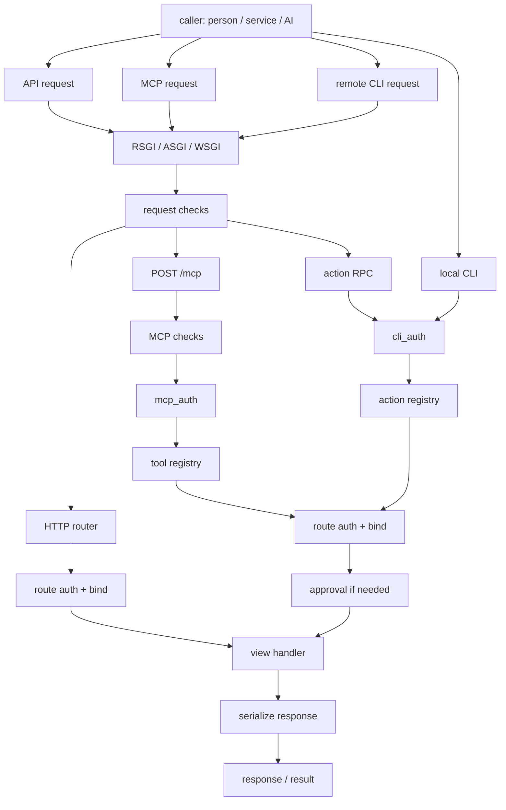

# Quater Manual

Quater is built around route-first operations. A route can stay a normal HTTP
endpoint, and when you opt in, Quater can derive an MCP tool or CLI action from
the same route metadata. The runtime surfaces are separate, but the business
handler, parameter binding, route-level auth, response normalization, and
generated schemas stay tied to one declaration.

A caller can be a person, a service, or an AI agent. The surface is what
matters: HTTP, MCP, and CLI enter the framework differently, then converge on the
same route handler path.

Hosted surfaces all arrive through the server adapter because they are HTTP
requests. Local CLI is the exception: it imports the app and runs in-process.

::: tip Start with the shape of the app
If you are new to Quater, read the quickstart first, then the actions guide.
Those two pages explain the core route model and the new local/remote CLI
workflow.
:::

## Reading Path

1. [Quickstart](/en/latest/quickstart)
   Build a small app, run it with `quater dev`, expose your first MCP tool, and
   expose your first CLI action.

2. [Actions and CLI](/en/latest/actions)
   Learn how `cli=True`, `cli_auth`, dry-run, remote action discovery, and
   approval-protected actions work.

3. [MCP](/en/latest/mcp)
   Expose selected routes as MCP tools, configure bearer auth, understand the
   MCP request lifecycle, and use approval tokens for sensitive tools.

4. [Security](/en/latest/security)
   Review host checks, body limits, CORS, MCP origin validation, CLI action
   security, docs endpoint exposure, and production server checks.

5. [Public API](/en/latest/api)
   Check the import surface, constructor options, route options, auth types,
   response classes, and advanced modules.

## Core Concepts

- **Route-first design:** HTTP, MCP, and CLI expose separate surfaces, but MCP
  tools and CLI actions are generated from the route definition when you opt in.
- **Explicit auth boundaries:** HTTP routes use route `auth=...`; MCP uses
  `mcp_auth`; CLI actions use `cli_auth`.
- **Progressive action discovery:** list or search for action names first, then
  describe one action to get its full schema and exact command.
- **Dry-run before execution:** every CLI action can validate inputs and return
  an argument hash without running the handler.
- **Approval hooks:** `needs_approval=True` adds a second gate for sensitive MCP
  tools and CLI actions.
