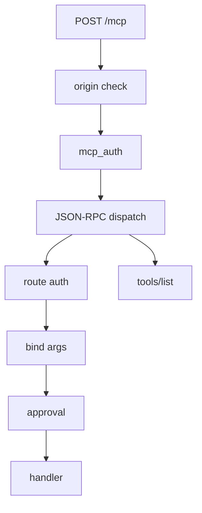

# MCP

Quater can expose selected HTTP routes as MCP tools.

The route definition is the source metadata for the tool. MCP is a separate
runtime surface from HTTP dispatch, but it is not a second copy of your business
logic. The generated tool calls the same handler and reuses the route's argument
binding, route-level auth, response normalization, description, and input
schema.

If you also expose a route with `cli=True`, the same route can be called by HTTP,
MCP, and the Quater CLI. See [Actions and CLI](/en/latest/actions) for the CLI
side of that model.

There is one extra rule: if the app exposes tools, it must define `mcp_auth`.
Tools are executable capabilities. Even `tools/list` reveals names, descriptions,
and schemas, so Quater does not expose a tool registry without an auth boundary.

## MCP Request Flow

Every MCP request is still an HTTP request, so auth is checked on each request.
`initialize` does not create a server-side session.



## The Auth Model

MCP auth has two layers.

- `mcp_auth` protects the MCP transport: `initialize`, `tools/list`,
  `tools/call`, and `/mcp/docs`.
- Route `auth=` protects a specific handler, the same way it does for normal
  HTTP.

Most apps use the same function for both:

```python
from quater import AuthContext, AuthRequest, Quater, Request


async def authenticate(ctx: AuthRequest) -> AuthContext | None:
    if ctx.headers.get("authorization") != "Bearer demo-token":
        return None
    return AuthContext(subject="demo-user")


app = Quater(
    mcp_allowed_origins=["http://localhost:3000"],
    mcp_auth=authenticate,
)


@app.get(
    "/users/{id:int}",
    tool=True,
    auth=authenticate,
    description="Fetch one protected user by id.",
)
async def get_user(id: int, request: Request) -> dict[str, object]:
    assert request.auth is not None
    return {"id": id, "subject": request.auth.subject}
```

When `mcp_auth` and route `auth=` are the same function, Quater runs it once for
an MCP tool call. If they are different functions, Quater runs both. That gives
you a clean split when you need one token for the MCP client and a separate
route-level user or scope check.

A route without `auth=` is still public over normal HTTP. Over MCP, it is behind
`mcp_auth` because the tool registry itself is protected.

## Configure MCP

The JSON-RPC endpoint is fixed:

```text
POST /mcp
```

There is no `mcp_path` option. If you host the app at
`https://api.example.com`, the MCP URL is:

```text
https://api.example.com/mcp
```

The human docs page defaults to:

```text
GET /mcp/docs
```

Set `mcp_docs_path=None` to turn off the page. The JSON-RPC endpoint stays
available.

For browser-based MCP clients, use `mcp_allowed_origins`:

```python
app = Quater(
    mcp_allowed_origins=["https://app.example.com"],
    mcp_auth=authenticate,
)
```

If `mcp_allowed_origins` is empty and CORS is configured, Quater uses the CORS
origins for MCP origin validation too.

## Expose A Tool

Routes are not tools unless they opt in:

```python
@app.get("/users/{id:int}", tool=True, description="Fetch one user by id.")
async def get_user(id: int) -> dict[str, int]:
    return {"id": id}
```

Descriptions are required. Use `description=` or a handler docstring. This text
is what an agent sees in `tools/list`, so write it like you are explaining when
to use the tool. `get_user` is a name. `Fetch one user by id.` is intent.

The route still works as HTTP:

```text
GET /users/123
```

It also appears in MCP discovery:

```json
{
  "jsonrpc": "2.0",
  "id": 1,
  "method": "tools/list"
}
```

## Client Requests

Authorization is normal HTTP authorization. If your client uses a bearer token,
send it on every MCP HTTP request:

```http
Authorization: Bearer <token>
```

`initialize` is not a login. Quater does not remember the token from
`initialize`, and an expired token on a later `tools/call` fails with
`401 Unauthorized`.

Many MCP clients use a config shaped roughly like this:

```json
{
  "mcpServers": {
    "quater": {
      "url": "https://api.example.com/mcp",
      "headers": {
        "Authorization": "Bearer <token>"
      }
    }
  }
}
```

Client config field names vary. The important parts are the `/mcp` URL and the
`Authorization` header on every request.

## Client Lifecycle

Clients start with `initialize`:

```json
{
  "jsonrpc": "2.0",
  "id": 1,
  "method": "initialize",
  "params": {
    "protocolVersion": "2025-06-18",
    "capabilities": {},
    "clientInfo": {"name": "my-client", "version": "1.0.0"}
  }
}
```

Quater responds with the negotiated protocol version, server metadata, and tool
capability. After that, clients may send `notifications/initialized`.

For later requests, clients may include `MCP-Protocol-Version`. Unsupported
versions are rejected with `400 Bad Request`.

Tool calls look like this:

```json
{
  "jsonrpc": "2.0",
  "id": 2,
  "method": "tools/call",
  "params": {
    "name": "get_user",
    "arguments": {"id": 123}
  }
}
```

## Approval-Protected Tools

Use `needs_approval=True` when a tool can change state or trigger work that
should require a second check.

```python
from quater import ApprovalRequest, AuthContext, AuthRequest, Quater


async def authenticate(ctx: AuthRequest) -> AuthContext | None:
    if ctx.headers.get("authorization") != "Bearer mcp-token":
        return None
    return AuthContext(subject="agent")


async def approve_action(ctx: ApprovalRequest) -> bool:
    return ctx.token == "approve-local"


app = Quater(
    mcp_auth=authenticate,
    action_approval=approve_action,
)


@app.patch(
    "/orders/{order_id}/status",
    tool=True,
    needs_approval=True,
    description="Update an order status.",
)
async def update_order_status(order_id: str, status: str) -> dict[str, str]:
    return {"order_id": order_id, "status": status}
```

The approval token is sent in `_meta`:

```json
{
  "jsonrpc": "2.0",
  "id": 3,
  "method": "tools/call",
  "params": {
    "name": "update_order_status",
    "arguments": {
      "order_id": "ord_1001",
      "status": "shipped"
    },
    "_meta": {
      "approvalToken": "approve-local"
    }
  }
}
```

If the token is missing, Quater returns a JSON-RPC error with
`data.code == "approval_required"` and includes the `arguments_hash`. Your
`action_approval` hook decides whether a token is valid for that action,
argument hash, authenticated subject, and request context.

::: tip Same approval hook as CLI actions
MCP tools and CLI actions share `needs_approval=True` and `action_approval`.
That keeps sensitive workflows consistent no matter how the route is called.
:::

## Request Context

The same handler can tell how it was called.

```python
from quater import Request


@app.get("/users/{id:int}", tool=True, description="Fetch one user by id.")
async def get_user(id: int, request: Request) -> dict[str, object]:
    return {
        "id": id,
        "source": request.context.source,
        "tool": request.context.tool_name,
    }
```

Normal HTTP calls use:

```python
request.context.source == "api"
request.context.tool_name is None
```

MCP protocol requests that are not tool calls use:

```python
request.context.source == "mcp"
request.context.tool_name is None
```

MCP tool calls use:

```python
request.context.source == "tool"
request.context.tool_name == "get_user"
request.context.action_name == "get_user"
```

Auth hooks receive the same context through `AuthRequest.context`. That is useful
when one hook accepts different tokens for browser API calls and MCP clients.

## Input And Output Docs

Quater generates `inputSchema` from path parameters, query parameters, and one
JSON body parameter. Required fields follow the handler signature and body model.

`GET /mcp/docs` shows the same tool data in a human page:

- tool name
- description
- auth marker
- HTTP route
- pretty JSON input schema
- pretty JSON output schema when the return annotation is useful
- example `tools/call` request

That page is for developers. MCP clients should use `tools/list`.

## Auditing

Pass `mcp_audit` to receive sanitized tool-call events:

```python
from quater import ToolAuditEvent


async def audit(event: ToolAuditEvent) -> None:
    print(event.tool_name, event.subject, event.success)


app = Quater(
    mcp_auth=authenticate,
    mcp_audit=audit,
)
```

Arguments are redacted before they reach the hook.
