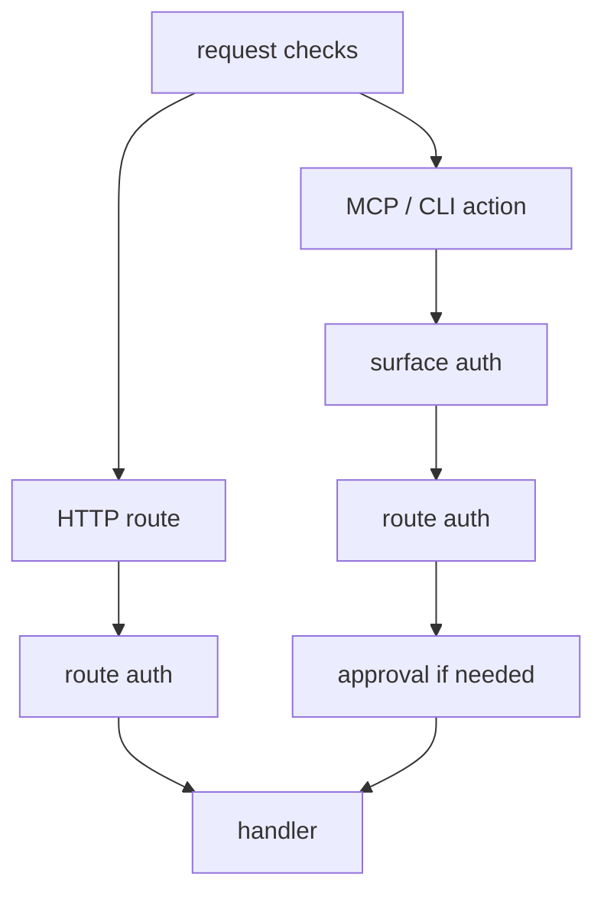

# Security

Quater runs security checks before auth, route handlers, and MCP tool lookup.
That order matters. Bad hosts, oversized bodies, and invalid MCP origins should
not reach user code.

## Security Flow

For HTTP, MCP, and remote CLI calls, Quater rejects unsafe requests before it
reaches user code. Local CLI calls do not have HTTP host or origin headers, but
they still use CLI auth, argument validation, route auth, and approval checks.



## Response Headers

Strict mode is the default. It adds baseline headers to handler responses,
framework errors, auth failures, 404s, 405s, and MCP responses:

- `X-Content-Type-Options: nosniff`
- `Referrer-Policy: same-origin`
- `X-Frame-Options: DENY`
- `Strict-Transport-Security` on HTTPS requests
- `Content-Security-Policy` when configured

Use `security="off"` only for controlled local or embedded cases.

## Hosts And Proxies

Use `allowed_hosts` to reject unexpected Host headers:

```python
app = Quater(allowed_hosts=["api.example.com"])
```

Use `trusted_proxies` only for proxy IPs or CIDR ranges you control:

```python
app = Quater(
    allowed_hosts=["api.example.com"],
    trusted_proxies=["10.0.0.0/8"],
)
```

Forwarded host and scheme headers are ignored unless the client IP matches a
trusted proxy.

## Body Limits

`max_body_size` defaults to `2mb` and applies before JSON decoding:

```python
app = Quater(max_body_size="2mb")
```

If `Content-Length` is larger than the limit, Quater rejects the request before
reading the stream.

## Auth

Quater does not ship a user system. You write an auth hook and attach it to the
routes that need it.

```python
from quater import AuthContext, AuthRequest, Quater, Request

app = Quater()


async def authenticate(ctx: AuthRequest) -> AuthContext | None:
    if ctx.headers.get("authorization") != "Bearer demo-token":
        return None
    return AuthContext(subject="demo-user")


@app.get("/me", auth=authenticate)
async def me(request: Request) -> dict[str, str]:
    assert request.auth is not None
    return {"subject": request.auth.subject}
```

Returning `None` gives `401 Unauthorized`. Routes without `auth=` stay public.

For MCP tools, pass an auth hook to the app as `mcp_auth`:

```python
app = Quater(mcp_auth=authenticate)
```

`mcp_auth` protects `initialize`, `tools/list`, `tools/call`, and `/mcp/docs`.
Route `auth=` still protects the handler. If `mcp_auth` and route `auth=` are
the same function, Quater still runs route auth against the handler route.

`AuthRequest.context.source` is `"api"` for normal HTTP routes, `"mcp"` for MCP
requests, and `"cli"` for Quater CLI actions. For MCP tool calls,
`AuthRequest.context.tool_name` is set before auth runs.

For CLI actions, pass an auth hook to the app as `cli_auth`:

```python
app = Quater(cli_auth=authenticate)
```

`cli_auth` protects local action discovery, local action execution, remote
manifest discovery, and remote action execution. If an app exposes even one
`cli=True` route, `cli_auth` is required.

CLI actions also receive request context:

- `context.source == "cli"` for both local and remote CLI actions.
- `context.entrypoint == "local"` for in-process local CLI calls.
- `context.entrypoint == "server"` for hosted action calls through the remote
  action protocol.

Route `auth=` still protects the handler. If `cli_auth` and route `auth=` are
the same function, Quater still runs route auth against the handler route.

## Approval Checks

`needs_approval=True` adds a second gate for exposed MCP tools and CLI actions.
Use it for operations that should not run on authentication alone.

```python
from quater import ApprovalRequest, Quater


async def approve_action(ctx: ApprovalRequest) -> bool:
    return ctx.token == "approve-local"


app = Quater(
    cli_auth=authenticate,
    action_approval=approve_action,
)


@app.patch(
    "/orders/{order_id}/status",
    cli=True,
    needs_approval=True,
    description="Update an order status.",
)
async def update_order_status(order_id: str, status: str) -> dict[str, str]:
    return {"order_id": order_id, "status": status}
```

Quater validates and binds action arguments before it calls `action_approval`.
The hook receives the action name, a stable argument hash, the submitted token,
the authenticated subject, and request context. Quater does not issue approval
tokens; your hook defines the policy.

Dry-run is available for every CLI action and returns the same argument hash
without calling the handler or approval hook.

## CORS And MCP Origins

Use `CORSConfig` for browser CORS headers:

```python
from quater import CORSConfig, Quater

app = Quater(
    cors=CORSConfig(
        allowed_origins=("https://app.example.com",),
        allow_credentials=True,
    )
)
```

MCP origin validation uses `mcp_allowed_origins` first. If that is empty and CORS
has exact origins, Quater reuses those exact origins for MCP too. A CORS wildcard
does not allow browser-based MCP calls; set explicit MCP origins for that.

```python
app = Quater(
    mcp_allowed_origins=["https://app.example.com"],
    mcp_auth=authenticate,
)
```

Invalid MCP origins are rejected before auth and before tool lookup.

MCP auth is checked per HTTP request. `initialize` does not create an
authenticated session, and Quater does not reuse its token for later calls.
Clients should send their bearer token on `initialize`, `tools/list`, and every
`tools/call`.

## Remote Action Protocol

When an app has `cli=True` routes, Quater exposes:

- `GET /.well-known/quater-actions.json`
- `POST /__quater__/actions/call`

Both endpoints use `cli_auth`. The manifest endpoint is protected because action
names, descriptions, paths, and schemas can reveal operational capabilities.
The RPC endpoint validates JSON shape, rejects unknown arguments, enforces
body limits, and caps action responses before returning them to the client.

Use the `quater` CLI instead of calling these endpoints directly.

## Production Server Checks

`quater dev` is for development. It enables reload by default.

`quater run` is for production. Before starting Granian, it checks that:

- `debug` is disabled.
- `security` is `"strict"`.
- `allowed_hosts` is configured.
- `allowed_hosts` does not contain `*`.

Use `--allow-insecure` only in a controlled environment where you intentionally
want to skip those checks.

## Request IDs And Access Logs

Quater accepts `x-request-id` by default, but only when the value is short,
printable ASCII, and safe to echo in a response header. Unsafe values are
replaced with a generated id before the handler, auth hooks, or access logger
see them.

`access_logger` receives structured request metadata after the response is
created. The event includes the request id, method, path, status code, duration,
source, entrypoint, client address, and current tool/action name. It does not
include request headers, request bodies, or query-string values.

## Documentation Endpoints

OpenAPI docs are public endpoints by default. That is useful in development and
sometimes fine in production. It is not always fine.

The MCP docs page is different. If `mcp_auth` is configured, `/mcp/docs` uses it.
If you expose tools, `mcp_auth` is required, so the MCP docs page is protected
too.

Defaults:

- `/docs` for Swagger UI.
- `/openapi.json` for OpenAPI JSON.
- `/mcp/docs` for human-readable MCP tool docs.

Disable them when route or tool metadata should not be public:

```python
app = Quater(
    docs_path=None,
    openapi_path=None,
    mcp_docs_path=None,
)
```

If `docs_path` is enabled, `openapi_path` must also be enabled.

## Signed Cookies

`SignedCookieSigner` signs small cookie values with HMAC and supports fallback
secrets for rotation:

```python
from quater import SignedCookieSigner

signer = SignedCookieSigner("new-secret", fallback_secrets=["old-secret"])
value = signer.sign("user_123")
subject = signer.verify(value)
```
